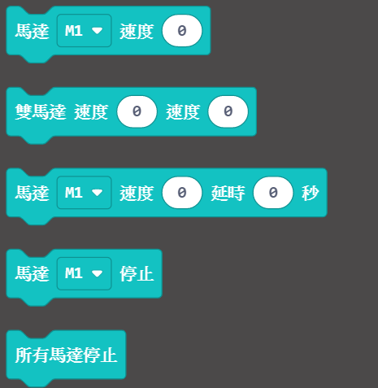
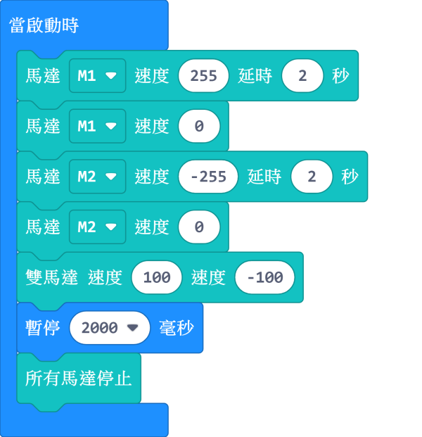
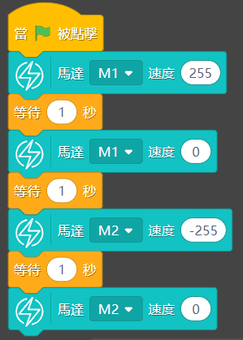

# All in 1水箱連水泵組合

All in 1水箱連水泵組合 (HKBM8015A)

內置浸入式水泵一體化水箱，簡潔方便；水箱頂蓋和底部兼容樂高顆粒件，適合用作智能灌溉、自動洗手機等。

## 產品參數

- 工作電壓：3.3V~6V
- 尺寸：86.5X86.5X98mm
- 額定電流：120mA(3.3V)
- 流量：80L/h
- 最大揚程：0.35M
- 重量：140g
- 膠管長度：60cm
- 接口：紅黑線

## MakeCode編程教學

加載PowerBrick插件：https://github.com/KittenBot/pxt-powerbrick

### 電機積木塊:

### 電機編程

## KittenBlock編程教學

### 加載PowerBrick插件

離線版與在線版同樣操作。

在左上角小貓logo旁邊的硬件欄選擇PowerBrick，加載Microbit與Powerbrick插件。

### 電機積木塊

### 電機編程

[參考程式下載](https://bit.ly/PowerbrickM12_01sb3)

## FAQ

1：為什麼我點擊積木塊沒有反應呢？

首先確保已經連接好Microbit，然後上載韌體再試一試。