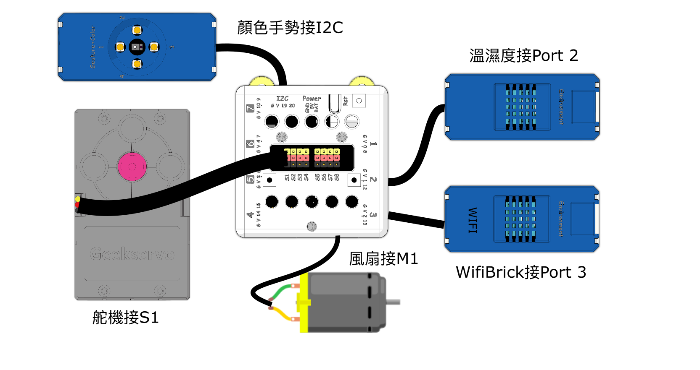
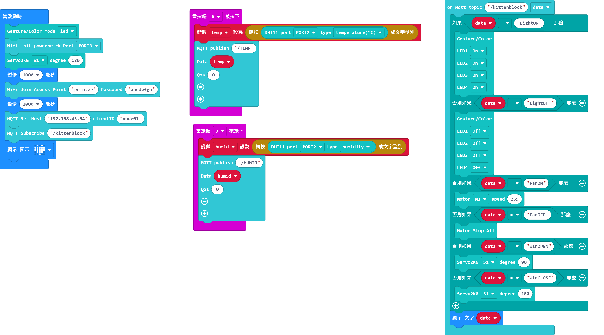
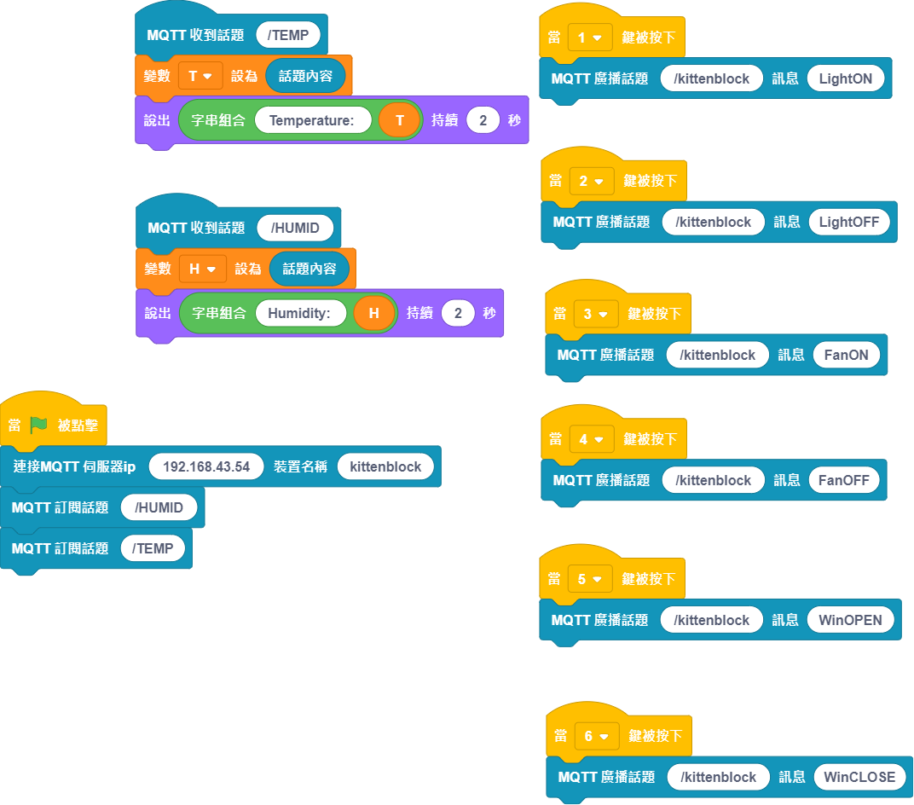

# 智能卧室

智能家居系統是一種現代流行的智能管理方式，主要的構成有如室內溫室控制，家電控制，安防系統等等。智能卧室的案例實現室內溫濕度檢測，外部噪聲檢測，以及卧室燈，窗，風扇設備的控制。

## 搭建說明書與參考程式資源包:

[資源包下載](http://bit.ly/AIOTKit_SH_ResourcsePack)

## 參考接線:

## 加入插件:

IoT:

## Micro:bit參考程式:

[參考程式下載](https://makecode.microbit.org/_LErLcJWgL42D)

## IoT參考程式:

## 啟動本地MQTT伺服器

## 程式流程

1. 將Micro:bit程式上載到Micro:bit。
1. 等待Wifibrick連上網絡。
2. IoT程式的小貓會說出探測到的氣溫與相對濕度。
3. 使用IoT程式控制房間的電器。1和2控制燈光，3和4控制大門，5和6控制風扇。
4. 按下A或B鍵會發佈溫濕度資料到伺服器，再由小貓說出。