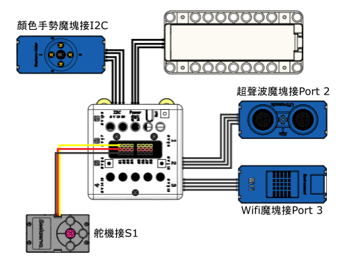

# 防溢垃圾桶

每當夏天，假如垃圾桶無法及時得到清理將會造成一些不良結果，有如異味大，細菌蚊蟲滋生，影響市民正常的垃圾投放。清潔工人所管轄的地域相當廣，得不到及時的信息反饋，無法作出準確的應對。所以智能垃圾桶的優勢不僅在於它的自動開關，還實現垃圾溢出前的信號反饋。相信這樣的信息化管理是未來城市的基本構成。

## 搭建說明書與參考程式資源包:

[資源包下載](http://bit.ly/AIOTKit_SH_ResourcsePack)

## 參考接線:

## 參考程式:

## 程式流程

1. 將程式上載到Micro:bit。
2. 將手放在垃圾桶前，垃圾桶會自動打開然後關上。
3. 當垃圾桶滿溢時會發出警告，按A打開垃圾桶，清理之後按B關上垃圾桶。