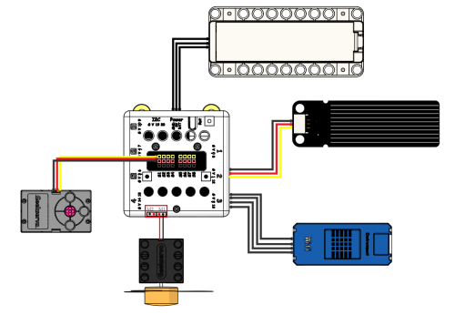
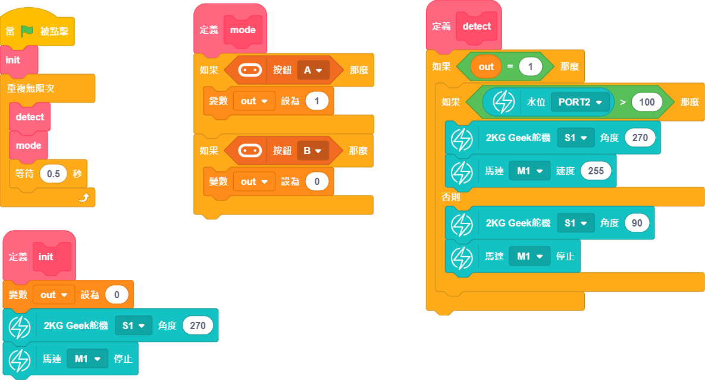

# 自動晾衣架

隨著科技發展，自動化深入日常生活的方方面面，家庭自動化設備也屬於智能家居的一個方面。為了更省心地實現衣物的充分晾曬，自動晾衣架能夠應對突如其來的天氣變化。

## 搭建說明書與參考程式資源包:

[資源包下載](http://bit.ly/AIOTKit_SH_ResourcsePack)

## 參考接線:

## 參考程式:

## 程式流程

1. 將程式上載到Micro:bit。
1. 按下A，啟動智能晾衣架。
2. 智能晾衣架會自動判斷是否有雨水，有雨水就收回衣桿，並且打開風扇，吹乾衣服，沒有就關閉風扇，伸出衣桿。