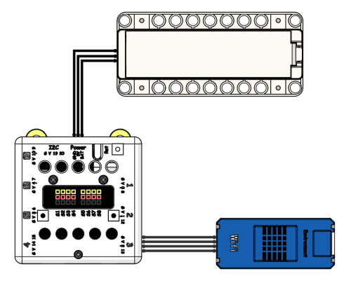
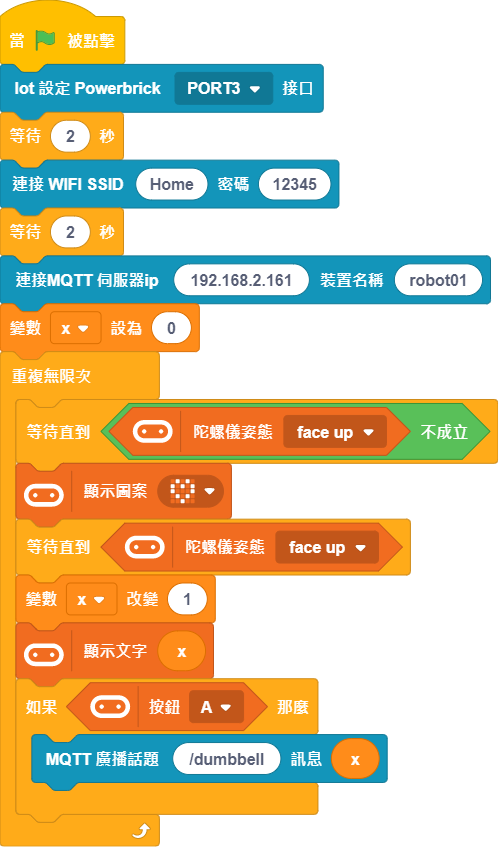
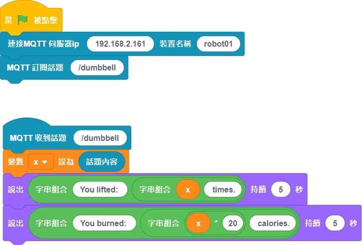
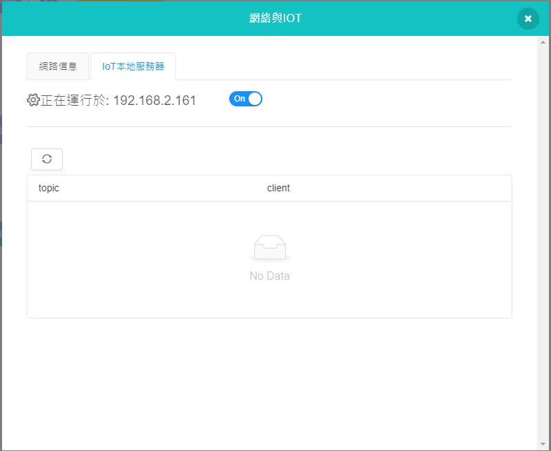

# 智能化健身啞鈴

所謂智能化就是將原本人為操作的事情用某種方式轉變為機器來代工。對於智能化健身器械來說，有如健身單車，通過使用它會將健身時間和卡路里消耗數據顯示在屏幕上，免去了人為計算的功夫，甚至更準確。健身啞鈴可以記錄抬舉的次數，上傳到雲端讓每天的健身數據得以可視化，概念性提倡鍛煉身體的重要性。

## 搭建說明書與參考程式資源包:

[資源包下載](http://bit.ly/AIOTKit_SH_ResourcsePack)

## 參考接線:

## 加入插件:

IoT:

## Micro:bit參考程式:

## IoT參考程式:

## 啟動本地MQTT伺服器

## 程式流程

1. 將Micro:bit程式上載到Micro:bit。
1. 等待Wifibrick連上網絡。
2. 使用啞鈴舉重。完成健身後按A，將訓練數據送上伺服器。
3. IoT程式的小貓會說出訓練數據。