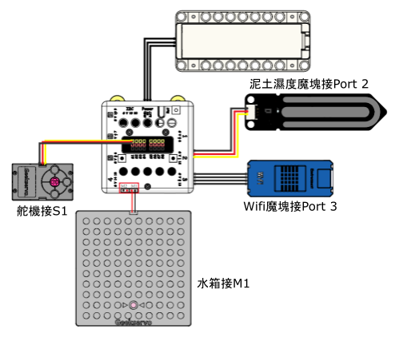
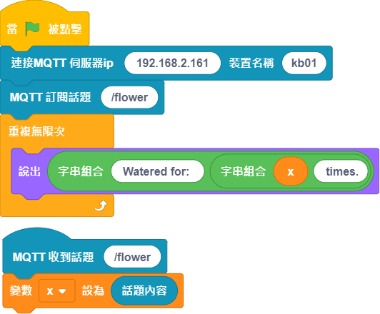

# 智能澆花裝置

大千世界，興趣各異，愛花花草草之人不乏。但難得出一趟遠門就不得不難為它們，時間長一點更是無法輓救。所以智能澆花裝置是必不可少，另外還帶有遠程報信功能，澆花完成通過郵件方式告知，另你更安心。

## 搭建說明書與參考程式資源包:

[資源包下載](http://bit.ly/AIOTKit_SH_ResourcsePack)

## 參考接線:

## 加入插件:

IoT:

## Micro:bit參考程式:

[參考程式下載](https://makecode.microbit.org/_MD5hwK62VK6L)

## IoT參考程式:

## 啟動本地MQTT伺服器

## 程式流程

1. 將Micro:bit程式上載到Micro:bit。
1. 等待Wifibrick連上網絡。
2. 當泥土土壤濕度太低，灑水器會自動啟動，並通知伺服器。
3. IoT程式的小貓會說出灑水次數。