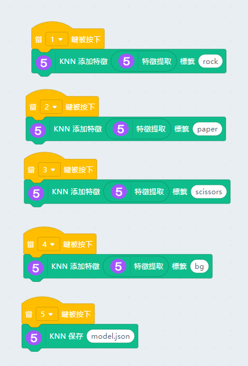

# 猜拳游戲

使用機器學習，我們可以訓練電腦與我們玩游戲。本案例使用了KNN模型演算法，訓練機械人與我們玩猜拳的遊戲。

## 搭建說明書與參考程式資源包:

[資源包下載](http://bit.ly/AIOTKit_SH_ResourcsePack)

## 參考接線:

## 加入插件:

視訊偵測:

Machine Learning:

## 參考訓練程式:

## 參考程式:

## 程式流程

1. 使用訓練程式，訓練辨認剪刀、石頭、布的模型。
2. 使用主程式，載入訓練好的模型。
3. 將Micro:bit連接到Kittenblock。**不需要將程式上載到Micro:bit。**
4. 按下空白鍵開始與機械人猜拳。
5. 機械人會必勝地作出動作。