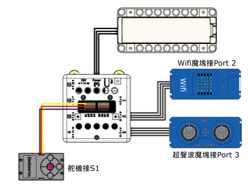

# 智能大門

隨著生物識別技術的發展，智能門的種類也有飛躍進展，出現了有如RFID(射頻識別)卡大門，指紋門，虹膜識別，面部識別等。本案例使用的就是面部識別技術，通過FaceAI插件對人臉識別，並加入編程邏輯是的門的功能豐富起來。

## 搭建說明書與參考程式資源包:

[資源包下載](http://bit.ly/AIOTKit_SH_ResourcsePack)

## 參考接線:

## 加入插件:

視訊偵測:

FaceAI:

IoT:

## 參考訓練程式:

## 參考程式:

## 程式流程

1. 使用訓練程式，建立你的人臉組別。
2. 使用主程式，將你訓練的人臉名稱添加到清單中。
3. 將Micro:bit連接到Kittenblock。**不需要將程式上載到Micro:bit。**
4. 程式偵測到熟悉的人臉後就會開門，進入後自動關門。
5. 你亦可以在主程式按下空白鍵，使用物聯網控制大門打開。