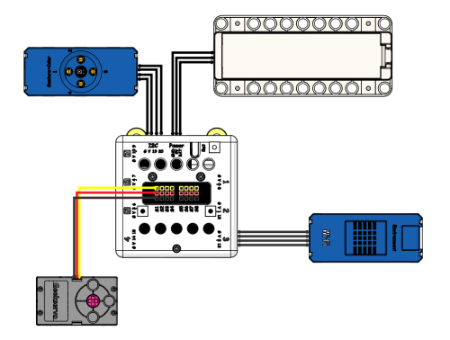

# 無感支付停車場

所謂的無感支付就是藉助某物獨一無二的特徵，綁定相關支付工具後，通過對這種特徵的圖像掃描識別，從而自動快捷支付的方式。應用在停車場中，高速收費站等領域，通過識別車牌自動收費，大大降低了等待時間並提升工作效率。

## 搭建說明書與參考程式資源包:

[資源包下載](http://bit.ly/AIOTKit_SH_ResourcsePack)

## 參考接線:

## 加入插件:

視訊偵測:

百度大腦:

## 參考程式:

## 程式流程

##### 這案例建議使用USB網絡攝像頭，將鏡頭放置在枱面上，逼真程度會比使用電腦內置攝像頭高。

1. 將Micro:bit連接到Kittenblock。**不需要將程式上載到Micro:bit。**
1. 按下1，辨認進入車輛之車牌號，並記錄進入時間。
2. 按下2，辨認離開車輛之車牌號，並記錄當前時間。
3. 程式顯示泊車時間並計算泊車費用。