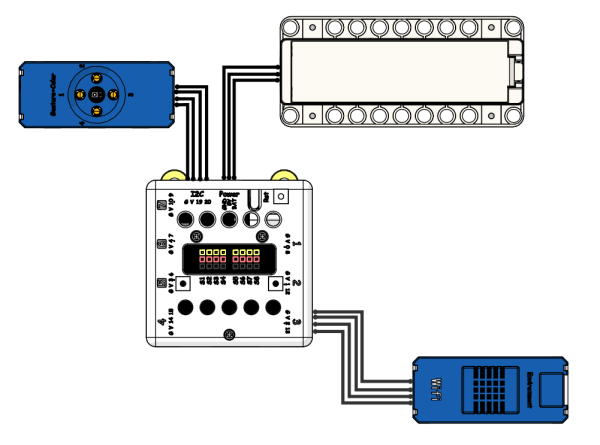
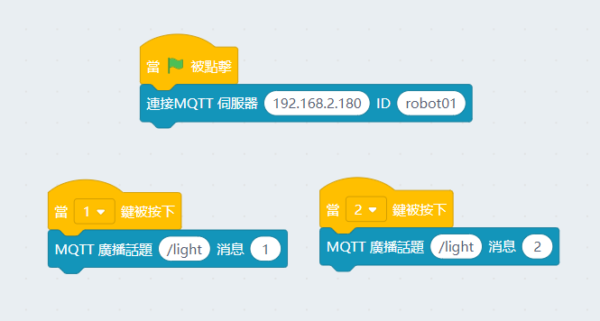
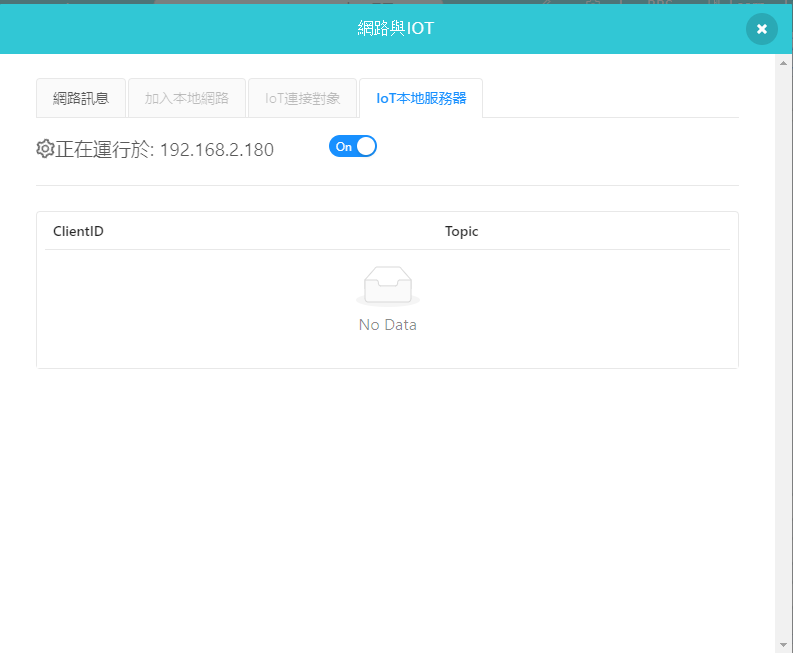

# 智能節能路燈

智慧路燈是智慧城市中的重要組成部分，常見於馬路兩端。路燈本身用以照明，功能單一，而今現代尤其是一線城市中，一個簡單的路燈竟集成了物聯網控制，車流檢測，故障報警，遠程抄表，自動亮度調節等。本案例將實現其中的2點：物聯網控制與自動亮度調節。

## 搭建說明書與參考程式資源包:

[資源包下載](http://bit.ly/AIOTKit_SH_ResourcsePack)

## 參考接線:

## 加入插件:

IoT:

## Micro:bit參考程式:

## IoT參考程式:

## 啟動本地MQTT伺服器

## 程式流程

1. 將Micro:bit程式上載到Micro:bit。
1. 等待Wifibrick連上網絡。
2. 使用IoT程式，向街燈送出信號。1開燈，2關燈。
3. 燈的亮度會隨著環境亮度(Micro:bit亮度感測)的讀數轉變。