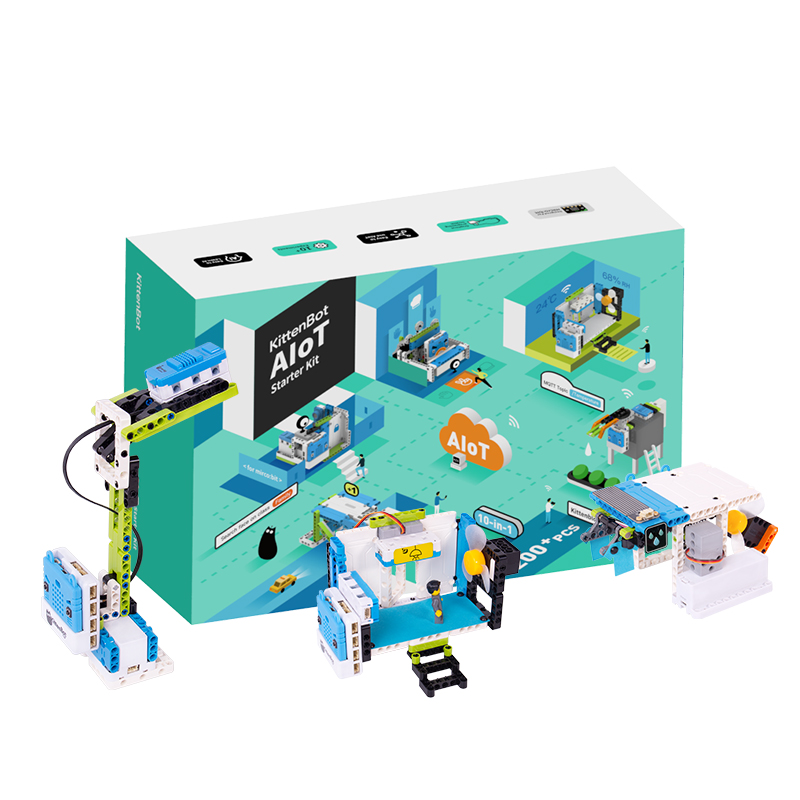
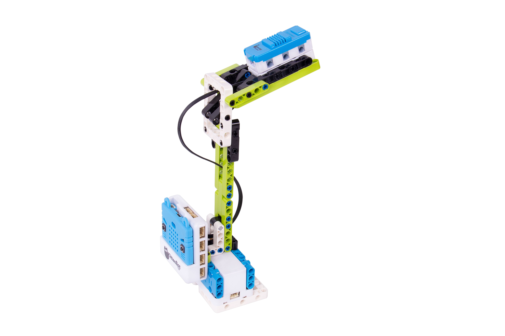
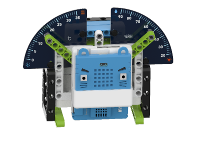

# AIOT Starter Kit介紹

AIoT Starter Kit (HKBK8036A)

  

## 適用人群  

培訓機構/學校教學  
 
## 產品簡介   
 
AIoT Starter Kit套件是一款以Micro:bit為主控的教學套件，內容針對人工智能(AI)與物聯網(AIoT)這兩項技術的應用，故此名為AIoT套件。

配合Kittenblock軟體中豐富人工智慧插件功能的具體化案例，結合透過Wifi實現的智能化物聯網，透過簡易的編程實現出AIoT的技術。在硬件方面，學生可以動手搭建不同的機械人與情境，令學生對於AIoT有更加深入與具體的理解，能夠將AIoT的知識與日常生活連接起來。

學生可以從有具體意義的案例中一步一步學習人工智能與物聯網這兩項熱門技術，預備學生將來投身在AI與IoT主導的社會中。

## 產品特色  

- 真正人工智能初體驗: 人臉識別、車牌識別、特徵模型訓練/識別 
- 基於Kittenblock的內置IoT伺服器，不但簡單易用而且方便學校教學，不需要擔心網絡問題。     
- 10個精心案例    

## 配送清單   

- Armourbit擴展板	x1
- GeekServo 2KG舵機	x2
- Wifibrick	x1
- 顏色手勢魔塊	x1
- 溫濕度魔塊    x1
- 超聲波聲音魔塊	x1
- 土壤濕度魔塊	x1
- 雨滴水位魔塊	x1
- 18650電池盒+電池	x1
- 樂高風扇模組	x1
- 水泵+樂高水箱	x1
- 4PIN防反插連接線	x4
- 3PIN防反插連接線	x1
- USB線	x1
- 積木包	x1
- 說明書    x1 

## 產品參數  

- 編程平台: Kittenblock  
- 主控: Micro:bit  
- 供電: 18650鋰電池(3.7V~4.2V) 
- 接線: 4Pin/3Pin 防反插線 
- 包裝盒尺寸: 245.5x176x91mm  

## 所體驗到的AI功能 

- 人臉識別 
- 車牌識別  
- 機器學習(特徵模型訓練&識別) 

## 應用介紹 

- 無人車閘: 車牌識別功能，自動記錄進入與離開之車輛，並實現出無感支付。

  

- 人臉識別大門: 人臉識別，為家庭成員打開大門，使用物聯網技術，開門給訪客。

  

- 智能路燈: 根據環境亮度改變路燈的亮度，達致節省能源與減少光污染的目的。  

  

- 智能垃圾桶: 無接觸式垃圾桶，不需要接觸垃圾桶，確保衛生。另外亦配備滿溢警告，當滿溢時提醒工作人員清理，確保街道整潔和衛生。   

  

- 智能氣象站: 將天氣資料顯示並上傳到物聯網進行分析。

  

- 智能卧室: 將臥室裏的電器透過物聯網連接起來，實現使用物聯網控制電器。   

  

- 智能晾衣架: 當雨滴傳感器檢測到有雨水，將自動收回晾曬衣物。  

  

- 智能灑水器: 自動對盆栽在適當時候曬水，並透過物聯網通知用戶植物情況。   

  

- 猜拳游戲: 利用機器學習，訓練電腦玩猜拳遊戲。   

  

- 智能啞鈴: 透過物聯網記錄健身數據，進行分析。  

  