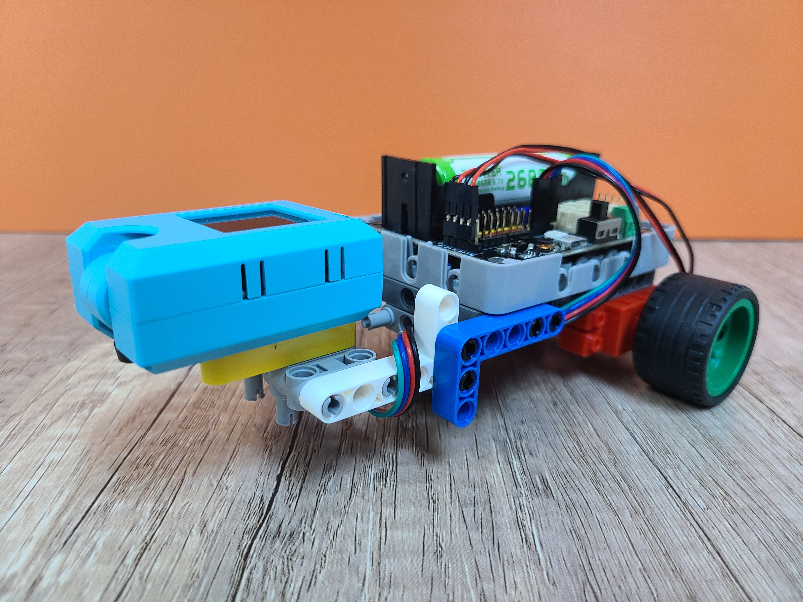
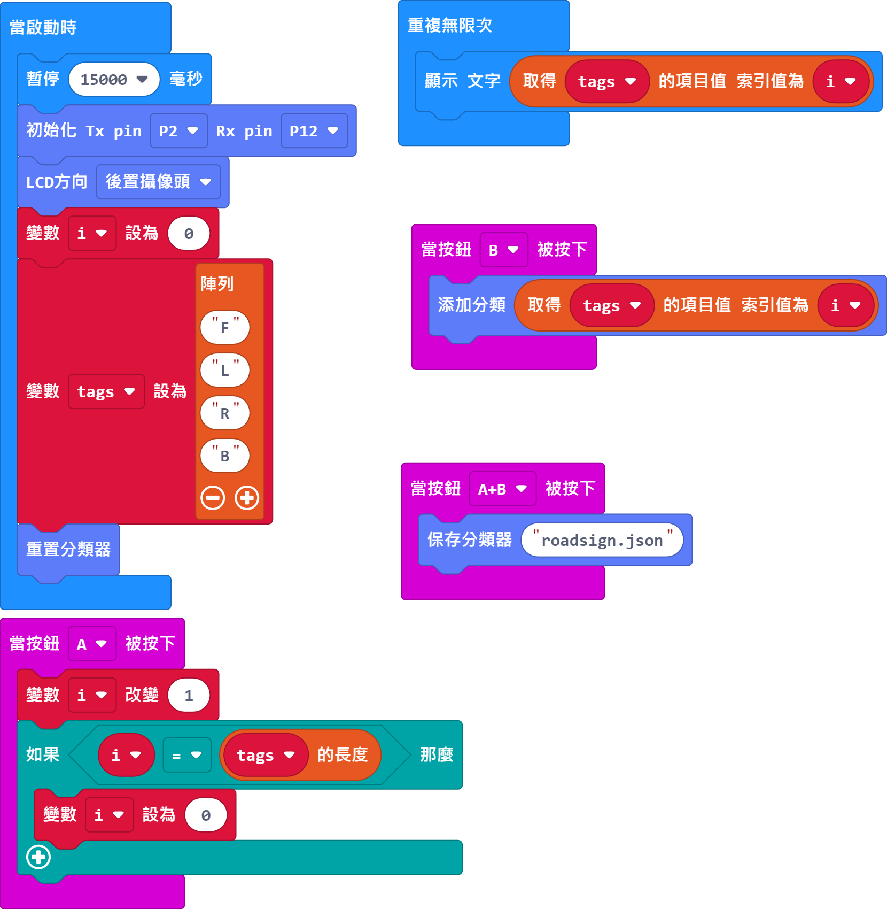
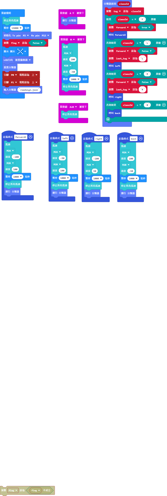

# AI無人自動駕駛

## 範例訓練程式

[訓練程式](https://makecode.microbit.org/_TxVgPWHgzAeJ)

## 範例主程式

[主程式](https://makecode.microbit.org/_dp6WqU3d3bEf)

## 玩法

首先使用訓練程式訓練模型。按B鍵添加分類，按A鍵切換到下一個分類。最後按A+B鍵儲存模型。

之後使用主程按A開始辨認，小車就會自動行駛。