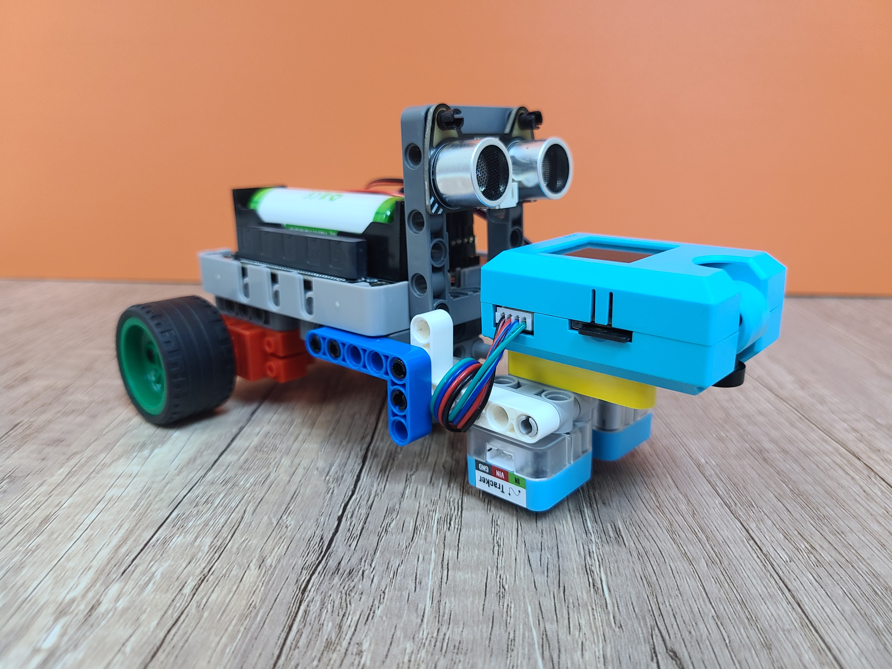
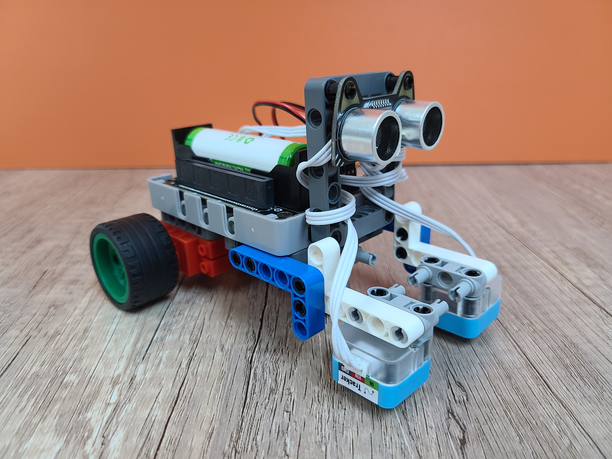

# Robotbit基礎小車

Robotbit基礎小車套件是為多種玩法而設計，透過配搭不同模組，小車可以實現到遙控、巡線、避障、自動駕駛等玩法。

## 套件特色

- 基礎小車可以加裝各式擴充實現不同玩法
    - 基礎小車可以玩搖控功能
    - 加裝巡線擴充，可以做到巡線行駛
    - 加裝超聲波擴充，可以做到避障功能
    - 加裝KOI，可以做到AI自動駕駛
- 支援MakeCode編程
    - 圖像化編程更輕易上手
- 兼容塑膠積木
    - 輕易搭建模型
- 使用防反插接口
    - 輕易完成接線
  
## 套件內容

1. Robotbit Edu x1
2. GeekServo 9G電機 x2
3. 18650鋰電池 x1
4. 塑膠積木包 x1
5. Sugar紅外巡線模組 x2
6. 貓耳超聲波 x1
7. KOI AI鏡頭 x1
8. 連接線
  
## 不同玩法展示

### 巡線小車

### 避障小車

### 巡線避障小車

### KOI人工智能小車

### 完全版小車

