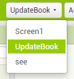
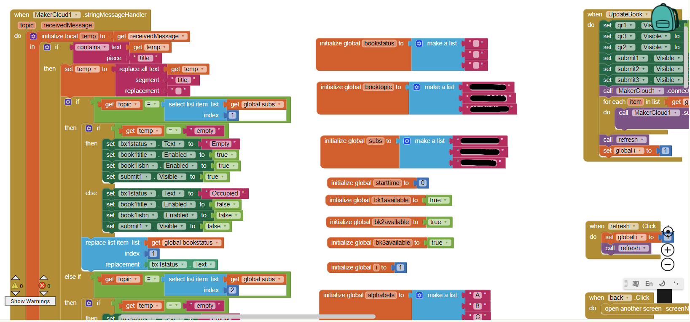
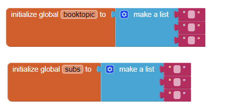
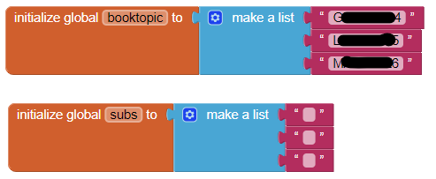
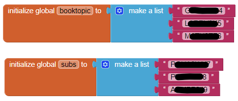
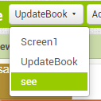
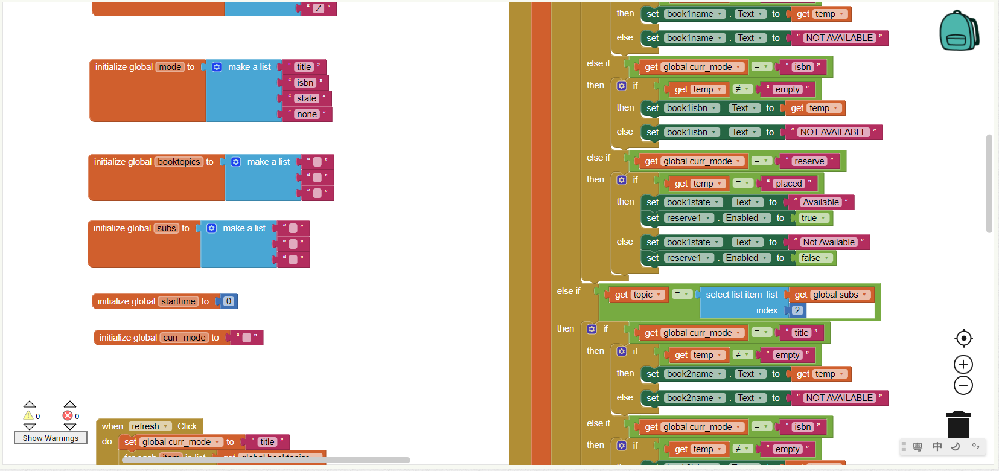
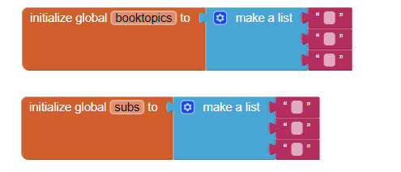
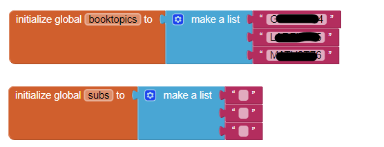
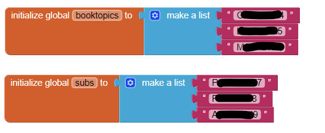

# AI2手機應用程式設定教學

## 下載AI2範例程式

[AI2範例程式](booksharing_edu_samplecode.aia)

    右鍵->另存連結為

## 修改ai2應用程式

### 1. 修改UpdateBook頁面

選擇UpdateBook頁面。

切換到編程模式。

將MakerCloud的Book 1~3的主題填入booktopic列表裡面。

將MakerCloud的Reply 1~3的主題填入subs列表裡面。

### 2. 修改see頁面

選擇see頁面。

切換到編程模式。

將MakerCloud的Book 1~3的主題填入booktopic列表裡面。

將MakerCloud的Reply 1~3的主題填入subs列表裡面。

