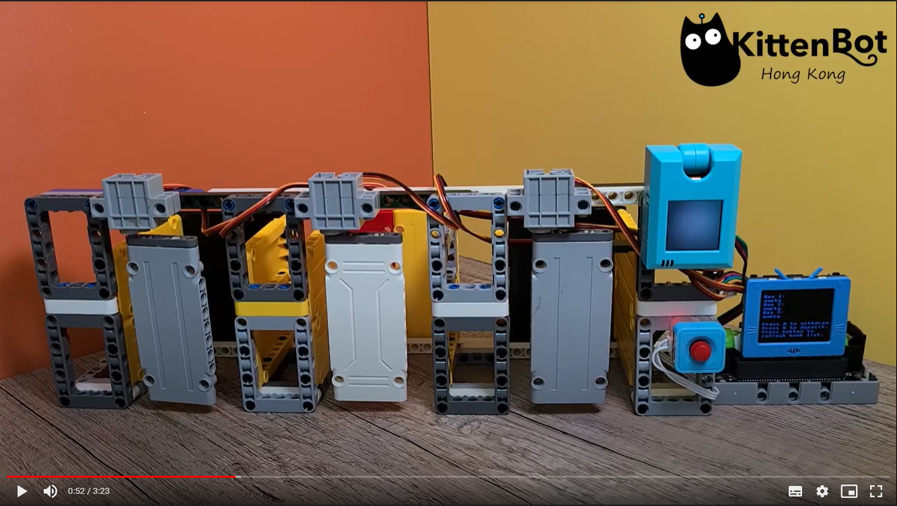

# 未來板範例程式

## 範例程式下載

[範例程式下載](https://github.com/kittenbothk/kittenbothk/raw/master/Kits/booksharing/booksharing.sb3)

[KOI聲音檔下載](https://github.com/kittenbothk/kittenbothk/raw/master/Kits/booksharing/sounds.zip)

## 修改範例程式

修改Wifi登入資料。

將Makercloud的Book 1~3主題填入book_topics裏。

將Makercloud的Reply 1~3主題填入subs裏。

## 範例程式使用方法

請參考以下短片。

[智能漂書機(教育版)示範](https://bit.ly/OnePileEduDemo)