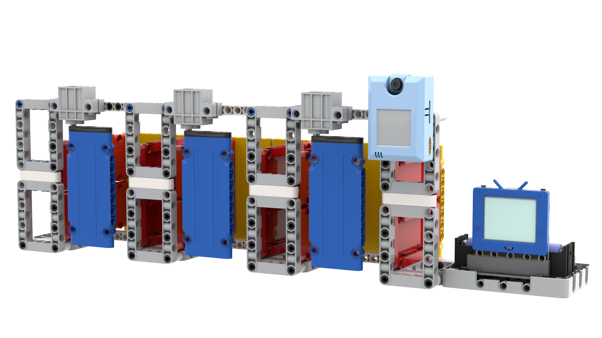
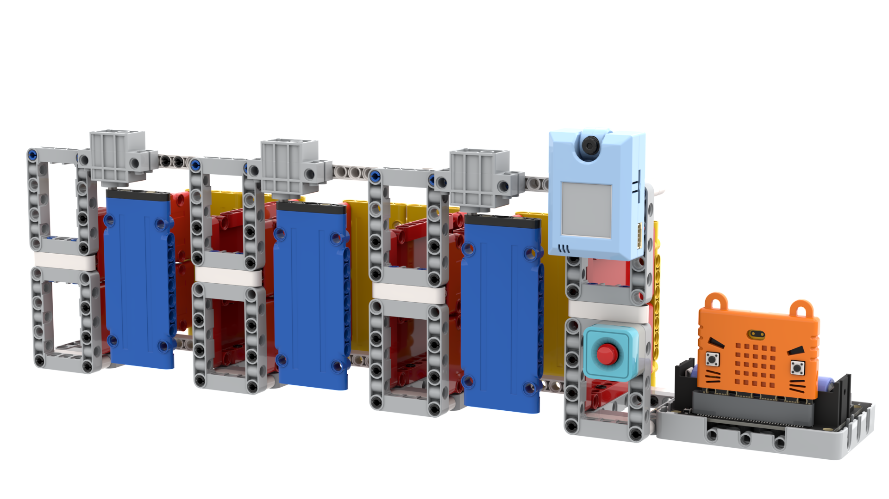
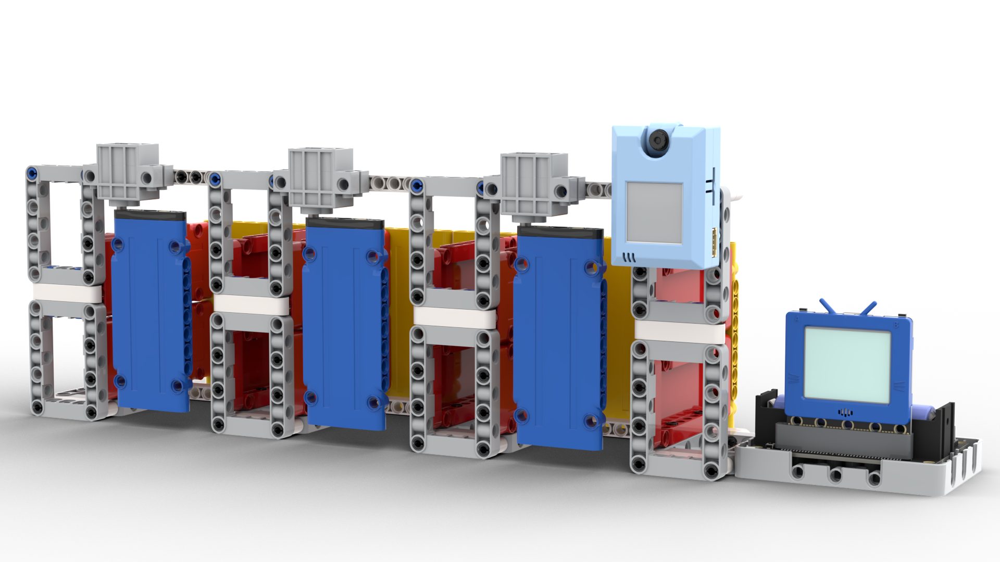

# 智能漂書櫃教育版

隨著漂書文化在香港越來越普及，Kittenbot將坊間的智能漂書櫃化為可以應用在課堂上的漂書櫃教育版，希望學生可以透過親自搭建模型和編寫程式明白漂書櫃背後的原理、更將漂書的閱讀風氣帶入校園。

## 套件特色

- 將智能漂書櫃縮小化
    - 在課堂上亦能輕易掌握
- 模擬真實漂書櫃功能完美
    - 模擬漂處櫃的二維碼掃描、手機應用程式等的功能
- 結合IoT平台
    - 學生能具體化了解IoT應用的原理
- 結合AI2手機應用程式
    - 學生可以嘗試編寫手機應用程式
- 親手搭建模型
    - 學生能了解漂書櫃背後的結構
- 支援圖像化編程
    - 學生也能掌握到
- 支援Micro:bit或未來板
    - 2款主控板都能做到主要的功能
    
## 套件內容

- 未來板連SD Card *1或Micro:bit *1(選配)
- Robotbit Edu *1
- KOI AI鏡頭連SD Card *1
- GeekServo 9G舵機 *3
- 18650鋰電池 *1
- 積木包 *1

## 示範短片

[智能漂書機(教育版)示範](https://bit.ly/OnePileEduDemo)

## 產品展示

