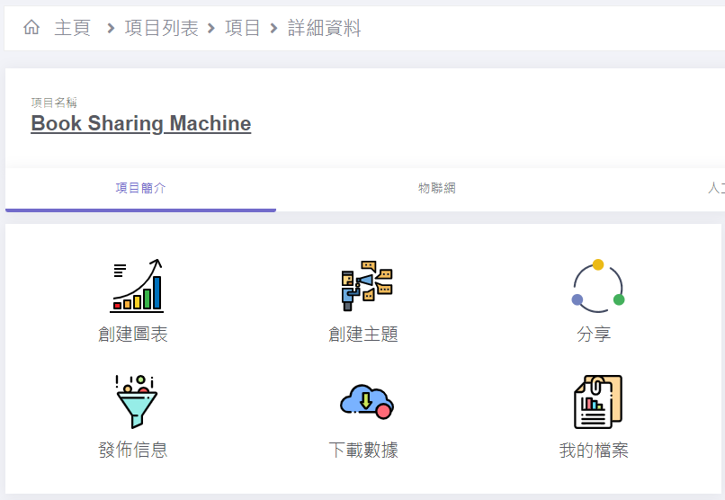

# MakerCloud創客雲設定教學

## 1. 創建新項目

## 2. 創建主題Book 1

## 3. 建立以下數據類型

## 4. 重複以上2個步驟，建立Book 2和Book 3主題

## 5. 建立數據類型

## 6. 創建主題Reply 1~3

## 7. 切換到數據觸發頁面

## 8. 搭建以下獲取Title小程式

## 9. 搭建以下獲取ISBN小程式

## 10. 搭建以下獲取Reserve小程式

### 11. 搭建以下獲取Key小程式

## 範例項目分享

[按此加入範例項目](https://www.makercloud.io/project/join/token/QPDZML7)