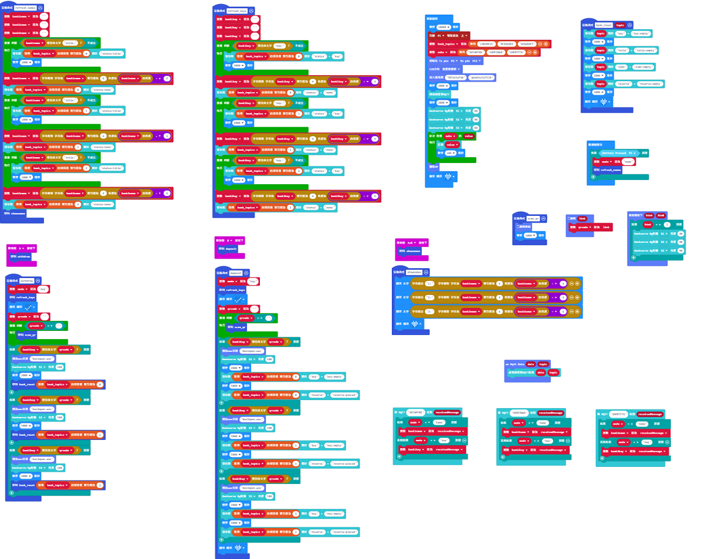

# Micro:bit範例程式

## 範例程式下載

[範例程式下載](https://makecode.microbit.org/_3Hpip4ibfThu)

[KOI聲音檔下載](https://github.com/kittenbothk/kittenbothk/raw/master/Kits/booksharing/sounds.zip)

## 修改範例程式

填入Wifi登入資料。

將MakerCloud的Book 1~3主題填入book_topics裏。

將MakerCloud的Reply 1~3主題填入subs裡面。

## 範例程式使用方法

請參考以下短片。

[智能漂書機(教育版)示範](https://bit.ly/OnePileEduDemo)