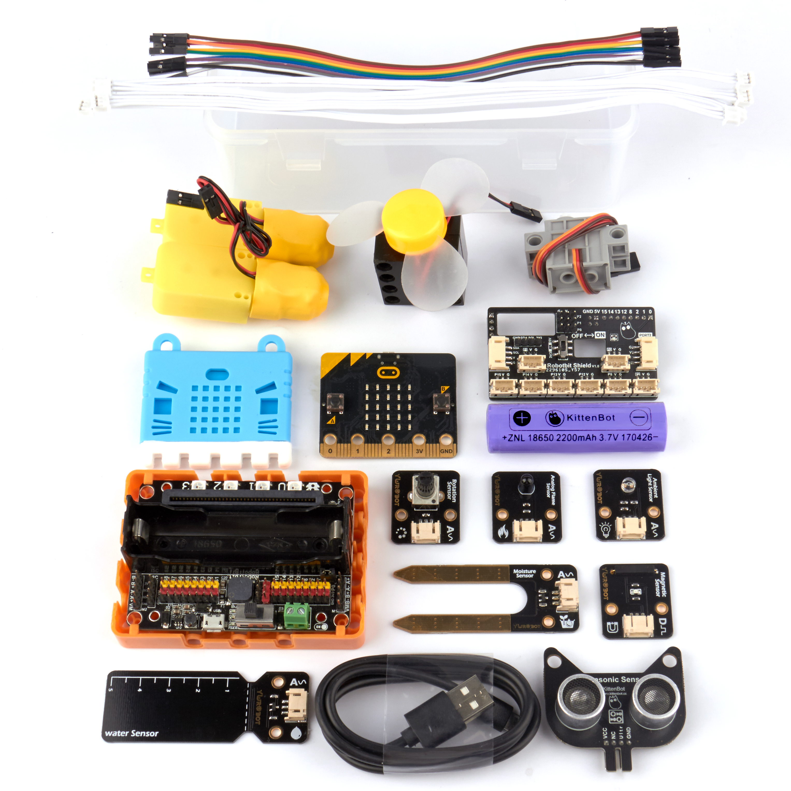

# Robotbit 大班教學套件介紹 **(已停產)**

Robotbit 大班教學套件

為針對香港學校課堂裏對STEM教育的需求，Kittenbot特意推出了Robotbit大班教學套件。      
以提升學校計劃式教學效率為目標，大班教學套件包括了Robotbit的擴展板和多款常用電子模組，涉及光、水、電、火等領域，讓學生在學習編程之餘還能學習科學的原理。

## 套件特色：

1. 以導師和學生都熟悉的Microbit作為主控板，讓大家能夠輕易上手，提升課堂效率
2. 配合Robotbit和Robotbit Shield，不再需要用鱷魚夾接線
3. 配合Robotbit強大的的驅動能力，可以支援各類電機舵機
4. 支援3pin和4pin防反插接口模組
5. 支援市面上其他模擬或數位電子零件
6. 容易收納，零件有儲存格，便於課堂後收拾和整理
7. 易於攜帶，盒子有便攜把手

## 套件內容：

- Robotbit擴展板x1
- Robotbit Shield擴展板x1
- T/T電機x1
- GeekServo 270度舵機x1
- 樂高風扇模組x1
- 超聲波感應器模組x1
- 電位器模組x1
- 光度感應器模組x1
- 火焰感應器模組x1
- 磁場感應器模組x1
- 土壤濕度感應器模組x1
- 水位感應器模組x1
- Wifibrick魔塊x1(只限IoT版)
- Robotbit底座x1
- Microbit矽膠保護套x1
- 母對母杜邦線x20
- 母杜邦線對4Pin防反插接口線x2
- 3Pin防反插線x2
- 18650鋰電池x1
- USB線x1

## 支援編程平台

- Microsoft Makecode

- Kittenblock

## 介紹短片：

## 開箱圖

