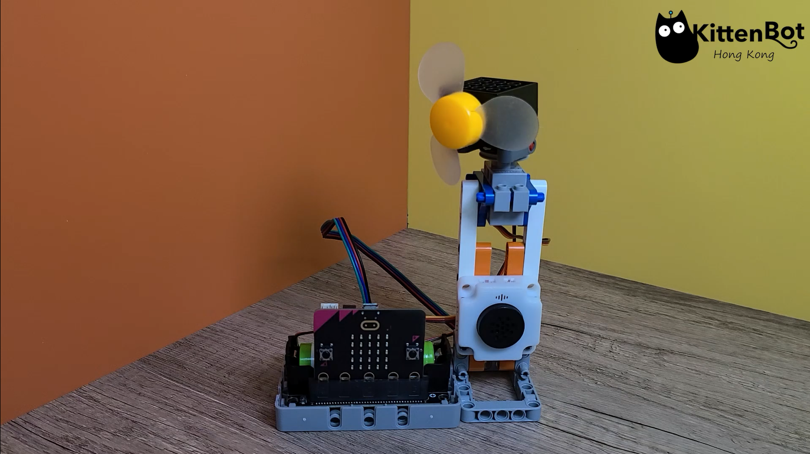
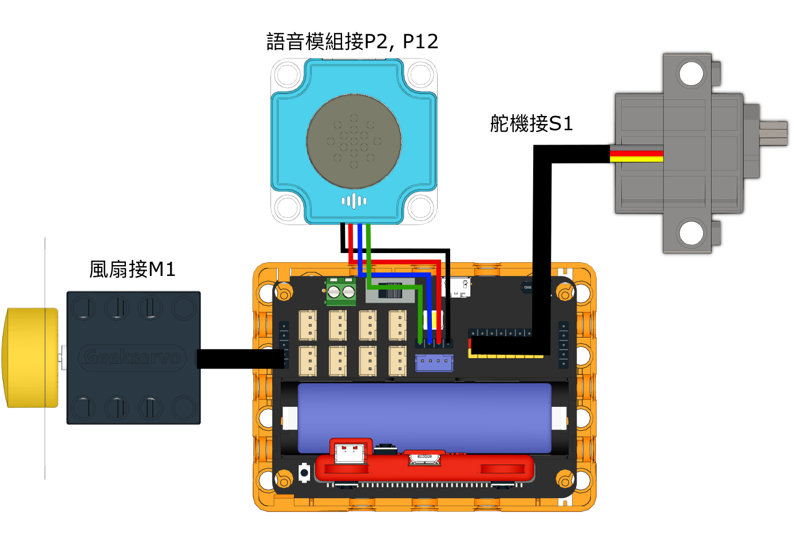
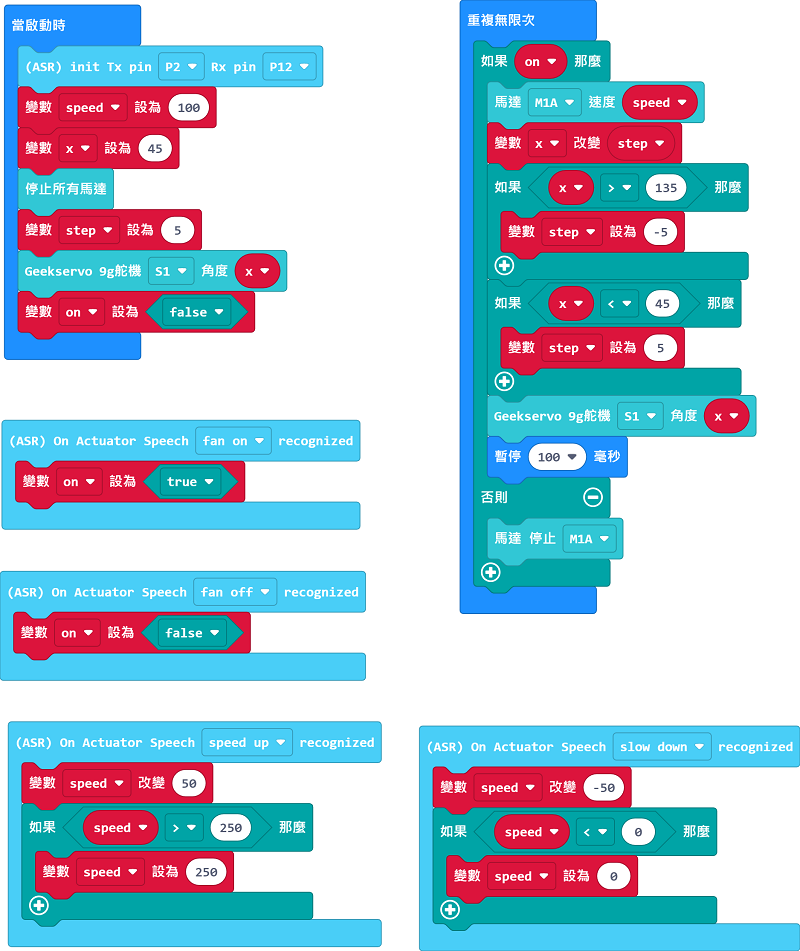

# 語音操控電風扇

## 組裝說明書下載

[下載組裝說明書](https://github.com/kittenbothk/kittenbothk/raw/master/Kits/classroom_inventor/asr_instructions/asr_fan.pdf)

## 參考接線

## 參考程式

[參考程式](https://makecode.microbit.org/_43oAoe5qib1y)

## 模型玩法

對著模型說Fan On或Fan Off，電風扇就會啟動或停止。

對著模型說Speed Up或Slow Down，電風扇就會加速或減速。