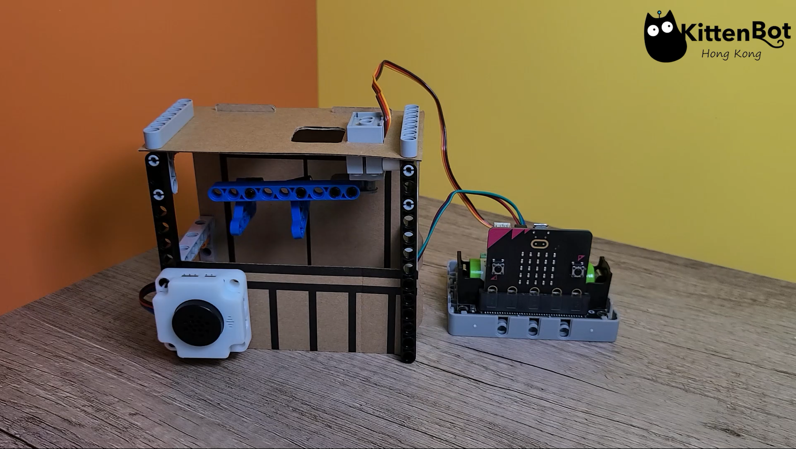
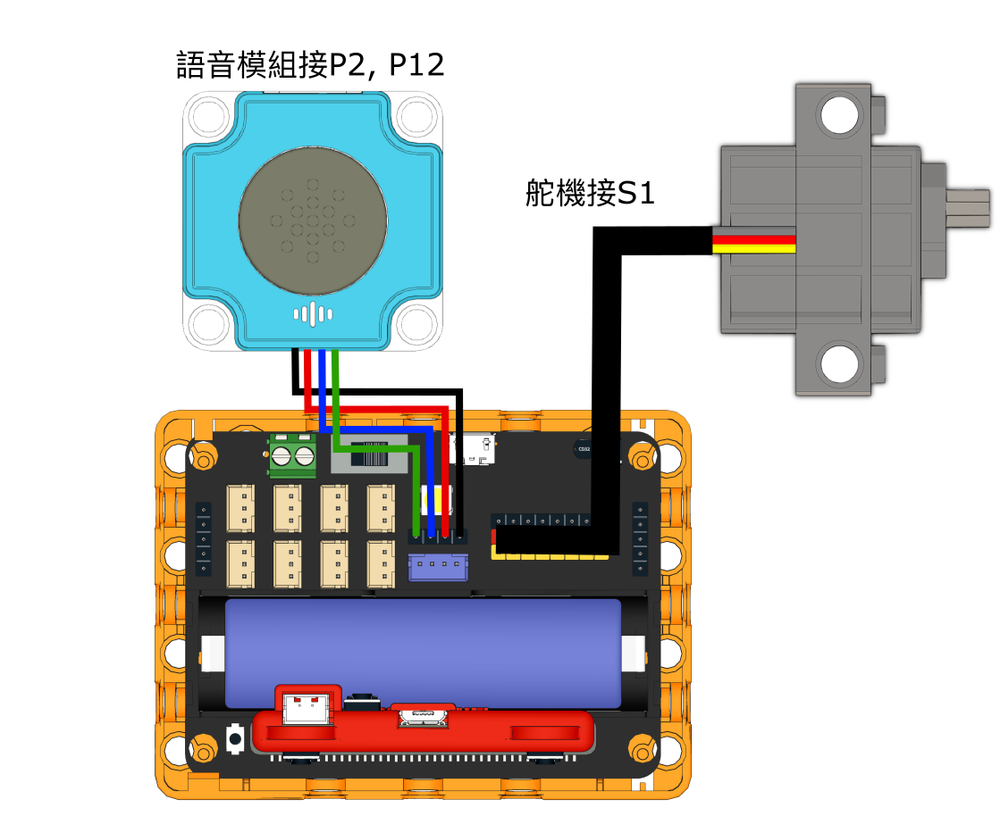
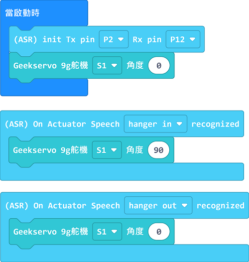

# 語音操控晾衣架

## 組裝說明書下載

[下載組裝說明書](https://github.com/kittenbothk/kittenbothk/raw/master/Kits/classroom_inventor/asr_instructions/asr_hanger.pdf)

## 參考接線

## 參考程式

[參考程式](https://makecode.microbit.org/_VpadWtc6jRF0)

## 模型玩法

對著模型說Hanger In或Hanger Out，晾衣架就會伸出或收入。