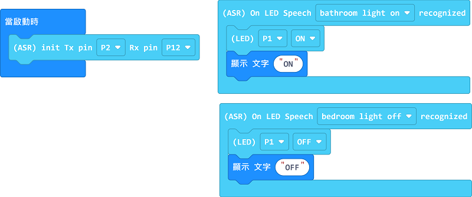

# 語音操控小夜燈

## 組裝說明書下載

[下載組裝說明書](https://github.com/kittenbothk/kittenbothk/raw/master/Kits/classroom_inventor/asr_instructions/asr_night_light.pdf)

## 參考程式

[參考程式](https://makecode.microbit.org/_6eW1zjM1khzr)

## 模型玩法

對著模型說Bedroom Light On或Bedroom Light Off，夜燈就會亮起或熄滅。