# Micro:bit小發明家套件

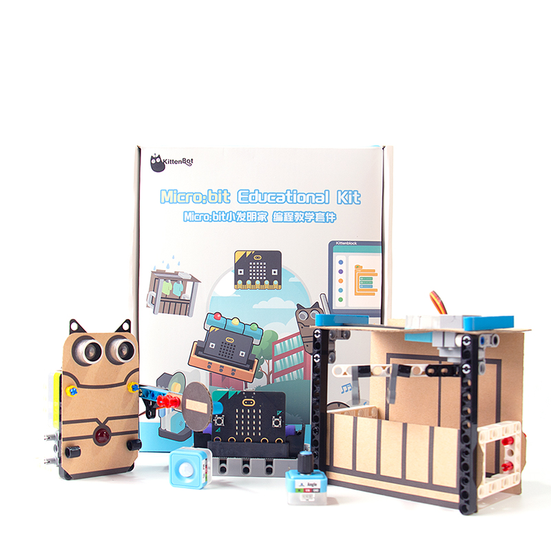

Micro:bit小發明家套件是Kittenbot針對STEM普及教育而設計的套件。套件包含新版本的Robotbit Edu，套裝裏的傳感器亦都轉用Sugar體系的傳感器。套件包含10個應用案例，配合拼砌積木與組合紙板給予學生新穎的學習體驗，激發創客精神。

## 產品特色

- 配合編程與簡單的結構，提供更具體的學習體驗
- Sugar的電子模組全方位用膠殼包圍，不怕碰撞或短路
- 採用防反接的接口，解決課堂處理接線的麻煩

## 產品參數

- 主控板：BBC Micro:bit V2
- 套件尺寸：205 x 182 x 75 mm

## 產品內容

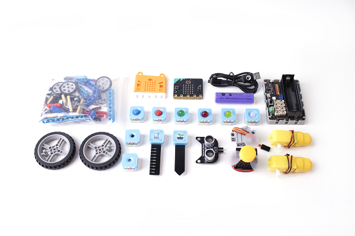

- Micro:bit V2 x1(選配)
- Robotbit Edu x1
- Robotbit底座 x1
- 18650鋰電池 x1
- Sugar LED模組 x3
- Sugar 按鍵模組 x2
- Sugar 光敏模組 x1
- Sugar 電位器模組 x1
- Sugar 人體紅外線模組 x1
- Sugar 火焰感應模組 x1
- Sugar 土壤濕度模組 x1
- Sugar 雨滴水位模組 x1
- 貓耳超聲波模組 x1
- GeekServo 9G舵機 x1
- GeekServo 樂高風扇 x1
- TT電機 x2
- 3Pin 連接線 x6
- 3Pin轉4Pin連接線(貓耳超聲波專用) x1
- 塑膠積木包 x1
- 裝飾結構紙板 x1
- 1m USB線 x1

### 編程平台
- Microsoft Makecode
- KittenBlock

## 產品特色

### 結合編程與簡單的結構就已經可搭建出具體的教學案例。

### Sugar系列的電子模塊安全又美觀，不但防跌防碰亦都防短路以確安全。

### Sugar系列的電子模塊帶有防反插設計，為課堂解決接線的煩惱。

## 介紹短片

[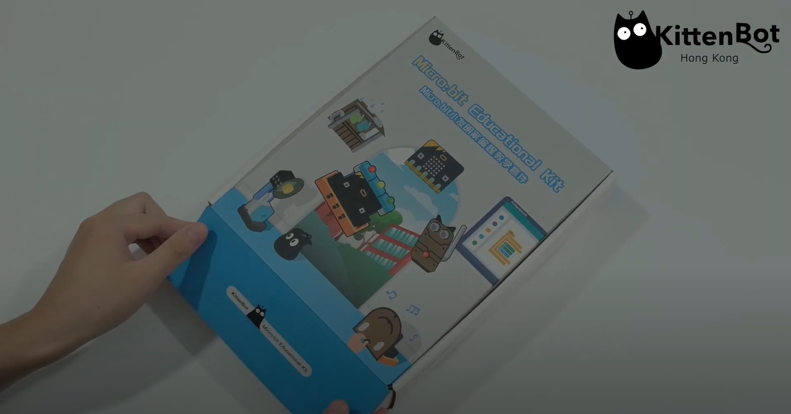](https://youtu.be/JaBa2EcIPDU)

## 應用案例介紹

### 防火警報

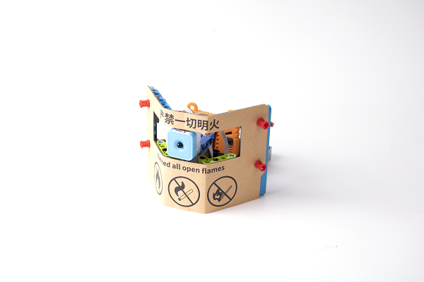

當火焰感應器探測到明火時就會發出警報。

    注意：此案例需要配合Micro:bit V2使用。

### 生日蠟燭

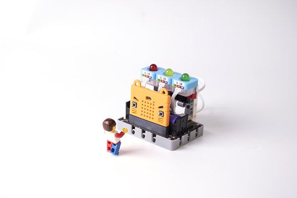

3色LED可以模擬生日蠟燭，對著Micro:bit V2的聲音傳感器吹氣可以模擬吹熄蠟燭。

    注意：此案例需要配合Micro:bit V2使用。

### 電子閘門

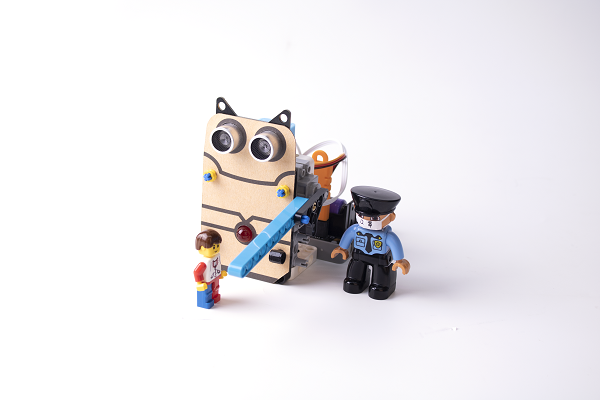

當有人時閘門會自動關閉，等到完成檢測才打開閘門讓人前進。

### 種植小助手

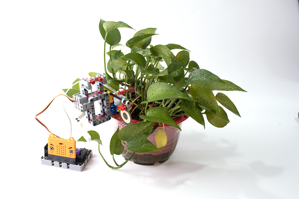

可以監測土壤的濕度，當土壤過濕或過乾時就會敲響鑼鼓。

    注意：此案例需要配合Micro:bit V2使用。

### 紅綠燈

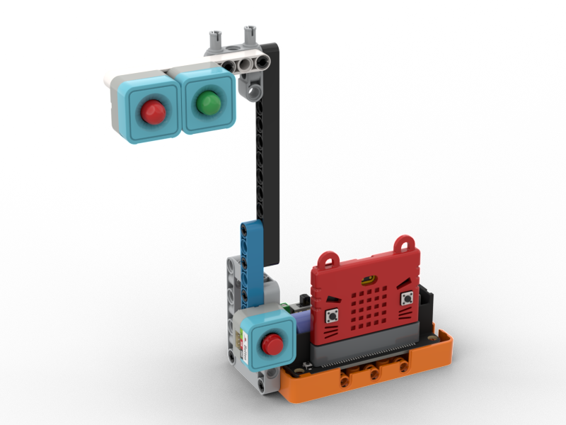

按下按鍵，紅綠燈就會亮起紅燈，讓行人可以橫過馬路。

### 三輪送貨車

能夠避開障礙物的三輪車。

    注意：此案例需要配合Micro:bit V2使用。

### 遙控三輪車

遙控的三輪車。

    注意：此案例需要配合Micro:bit V2使用。

### 智能晾衣架

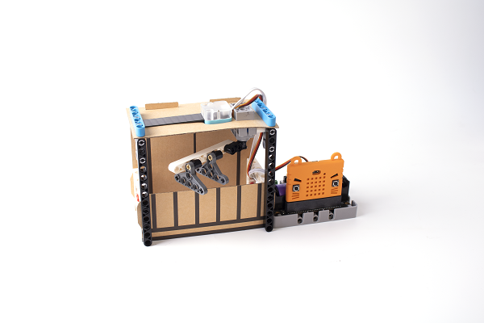

落雨的時候，晾衣架會自動收起，以免弄濕衣服。

### 怕光殭屍

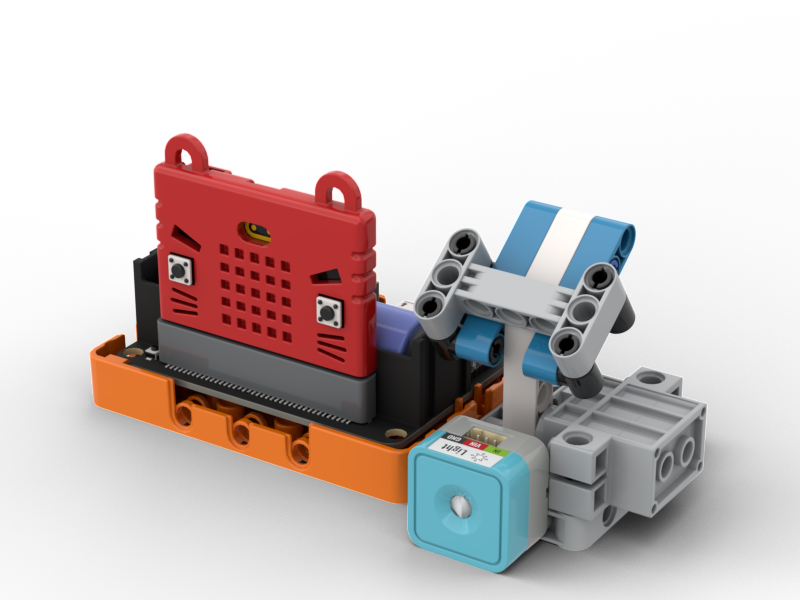

使用電筒照住殭屍的遊戲。

    注意：此案例需要配合Micro:bit V2使用。

### 恒温風扇

電動風扇會左右搖擺。

### 小夜燈

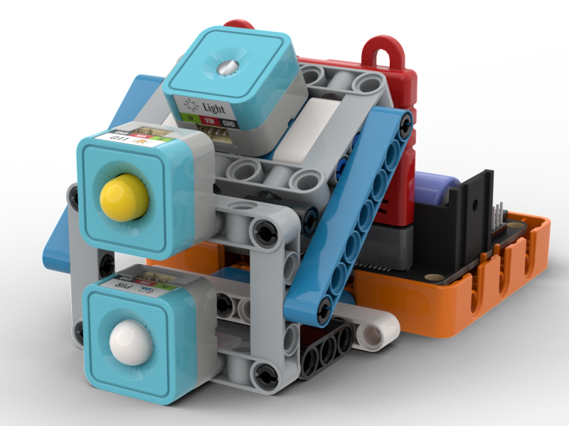

模擬夜燈，環境黑暗時探測到有人就會點燈以防跌倒。

### 模擬收音機

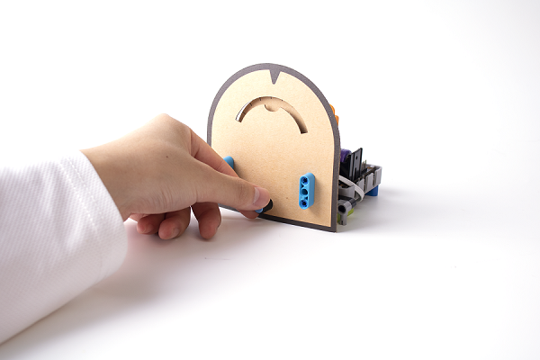

模擬一個收音器，要調校到正確頻道才可接收廣播。

    注意：此案例需要配合Micro:bit V2使用。

### 節拍機

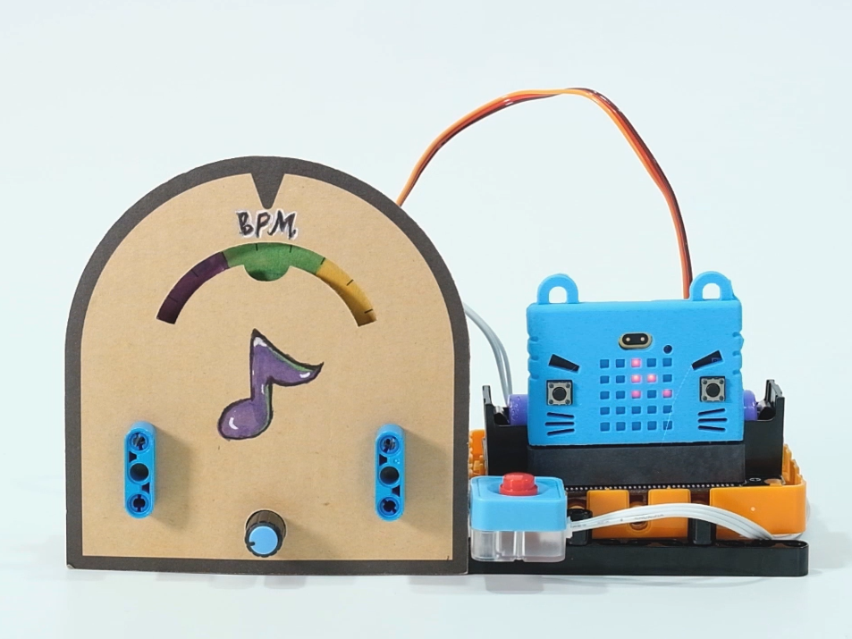

使用電位器調較速度，用A和B鍵選擇拍子，按下數碼按鍵啟動拍子機。

    注意：此案例需要配合Micro:bit V2使用。

### 搶答機

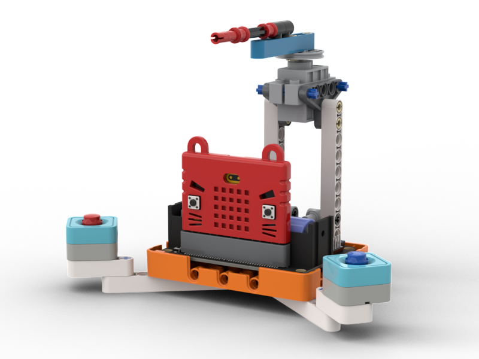

模擬搶答環節的搶答機。

    注意：此案例需要配合Micro:bit V2使用。

### 保險箱

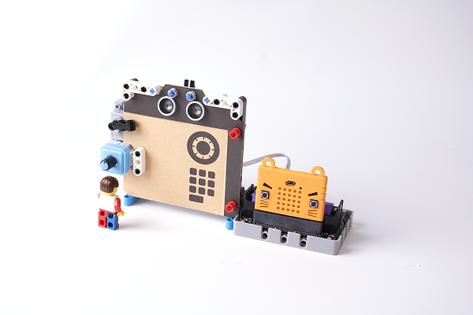

假如密碼正確就會打開夾萬。

    注意：此案例需要配合Micro:bit V2使用。

### 鋼琴拉奏

利用距離控制音調的鋼琴。

    注意：此案例需要配合Micro:bit V2使用。