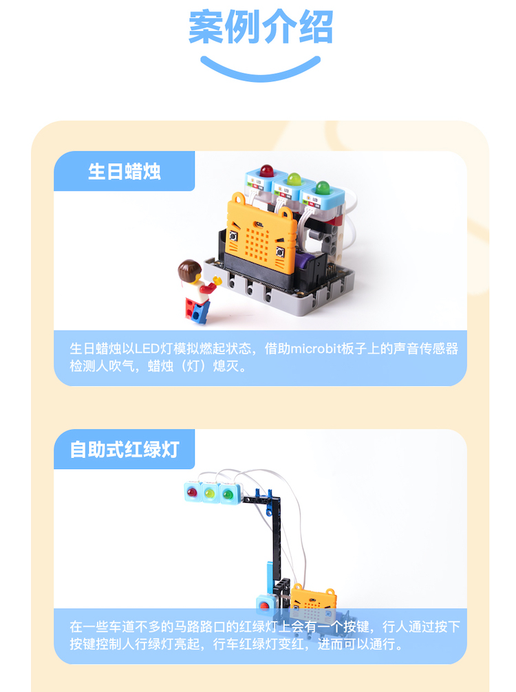
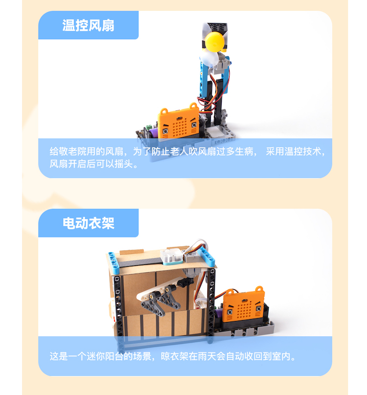
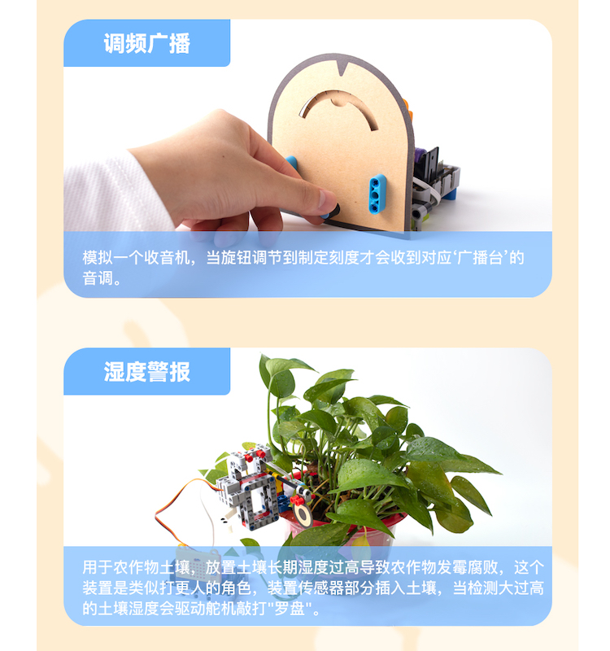
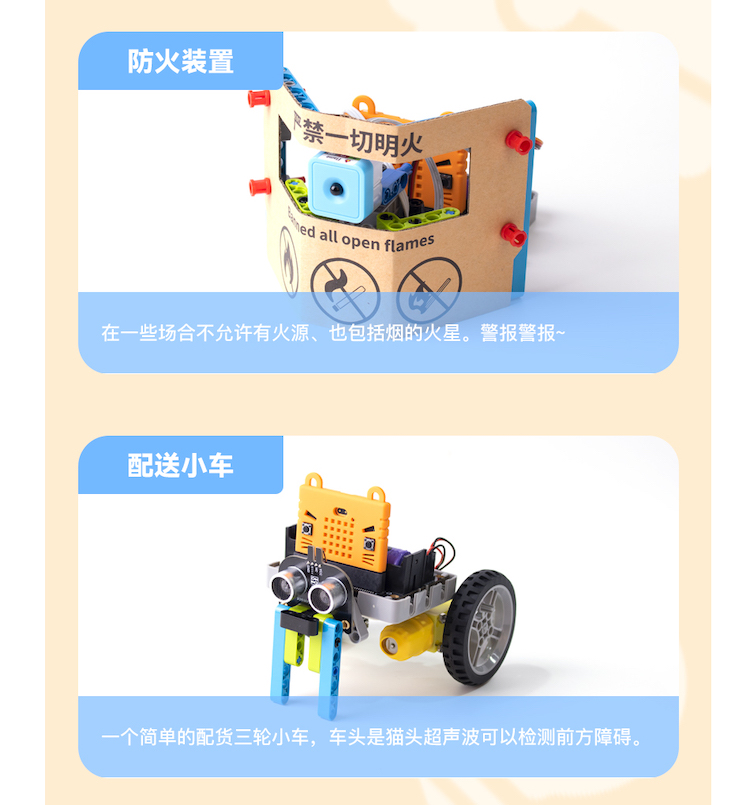
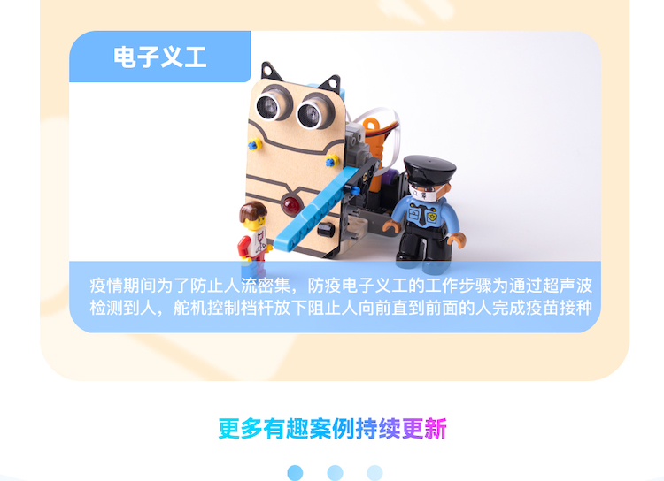
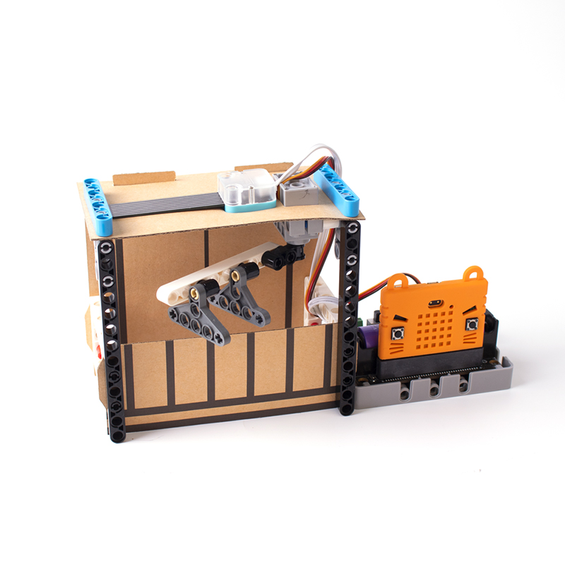
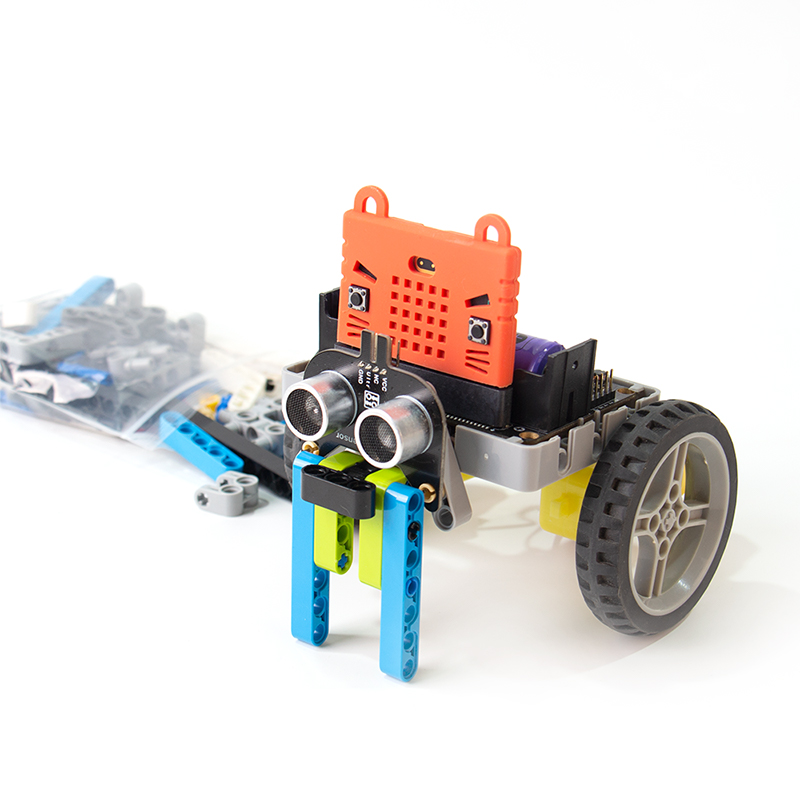
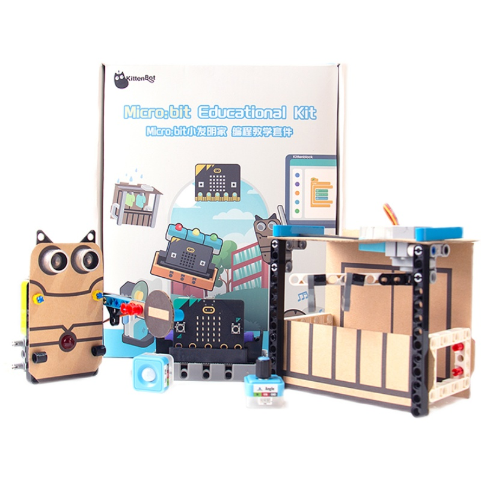

# Micro:bit大班教學 小發明家套件

Micro:bit大班教學小發明家套件是Kittenbot針對STEM普及教育而設計的套件。套件包含新版本的Robotbit Edu，套裝裏的傳感器亦都轉用Sugar體系的傳感器。套件包含10個應用案例，配合拼砌積木與組合紙板給予學生新穎的學習體驗，激發創客精神。

## 產品特色

- 配合編程與簡單的結構，提供更具體的學習體驗
- Sugar的電子模組全方位用膠殼包圍，不怕碰撞或短路
- 採用防反接的接口，解決課堂處理接線的麻煩

## 產品參數

- 主控板：BBC Micro:bit
- 套件尺寸：205 x 182 x 75 mm

## 產品內容

- Micro:bit V2 x1(選配)
- Robotbit Edu x1
- Robotbit底座 x1
- 18650鋰電池 x1
- Sugar LED模組 x3
- Sugar 按鍵模組 x2
- Sugar 光敏模組 x1
- Sugar 電位器模組 x1
- Sugar 人體紅外線模組 x1
- Sugar 火焰感應模組 x1
- Sugar 土壤濕度模組 x1
- Sugar 雨滴水位模組 x1
- 貓耳超聲波模組 x1
- GeekServo 9G舵機 x1
- GeekServo 樂高風扇 x1
- TT電機 x2
- 3Pin 連接線 x6
- 塑膠積木包 x1
- 裝飾結構紙板 x1
- 1m USB線 x1

### 編程平台
- Microsoft Makecode
- KittenBlock

## 介紹短片

## 應用案例介紹

## 產品展示

