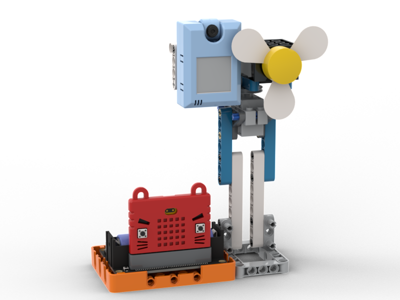
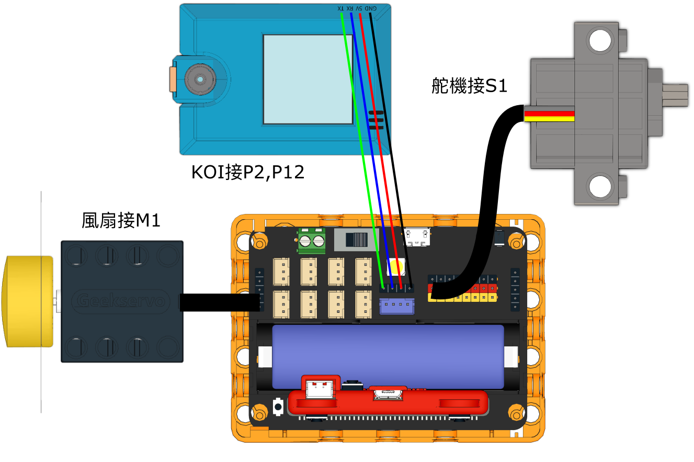

# AI人面追蹤風扇

## 組裝說明書下載

[組裝說明書下載](https://drive.google.com/drive/folders/1vPB1nm2KgCbI8fHl_VWVD3YiAxTgYQWc?usp=sharing)

## 參考程式

[參考程式下載](https://makecode.microbit.org/_UPHJE8MiaM5j)

## 模型玩法

風扇會左右擺動，當檢測到人臉就會開動風扇。