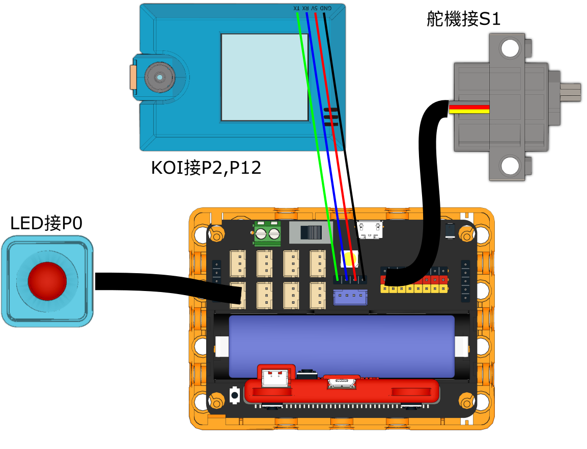
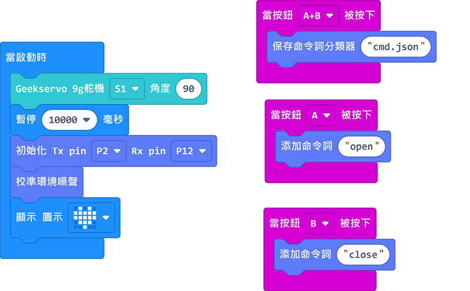
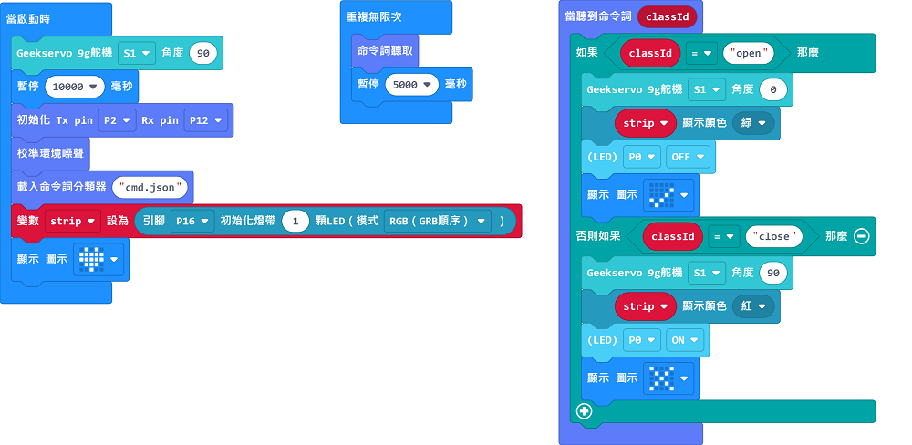

# 芝麻閘門

## 組裝說明書下載

[組裝說明書下載](https://drive.google.com/drive/folders/1vPB1nm2KgCbI8fHl_VWVD3YiAxTgYQWc?usp=sharing)

## 參考程式

### 訓練程式

[參考程式下載](https://makecode.microbit.org/_07uAyKV7sdYU)

### 主程式

[參考程式下載](https://makecode.microbit.org/_ieEEXA7po2Tb)

## 模型玩法

首先用訓練程式，按A錄下開閘，按B錄下關閘。按A+B儲存模型。

然後使用辨認程式，對KOI說出指令就會打開或關上閘門。