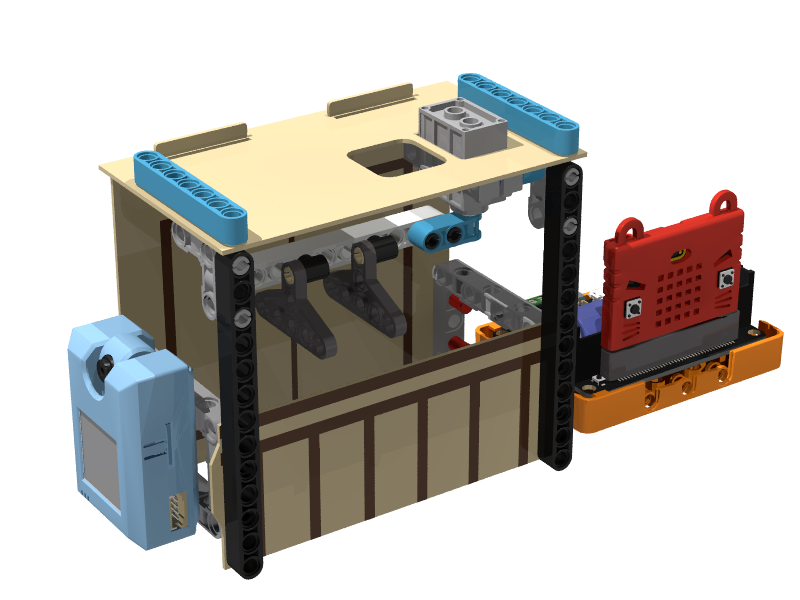
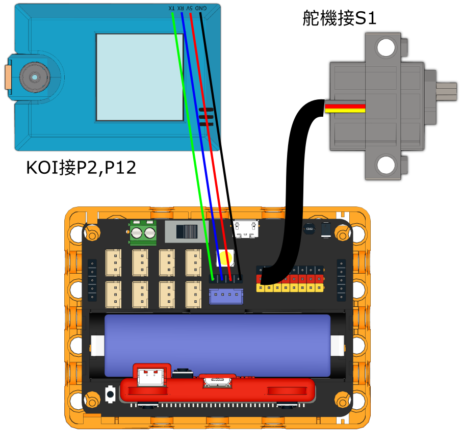
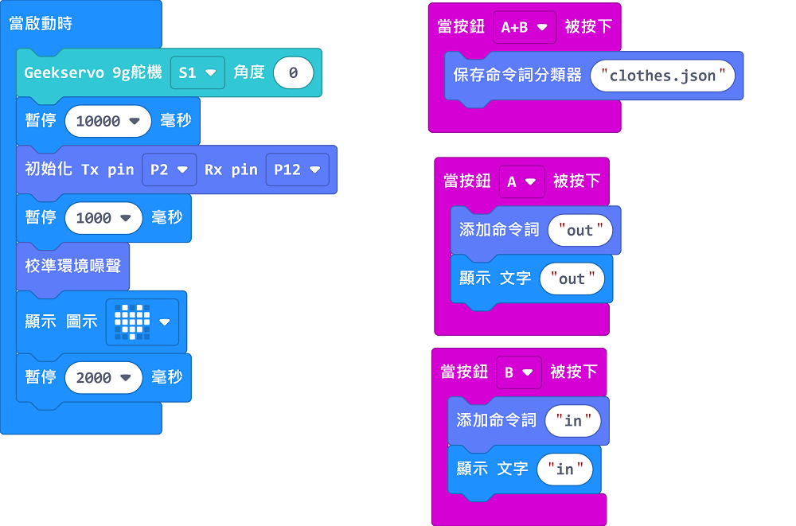
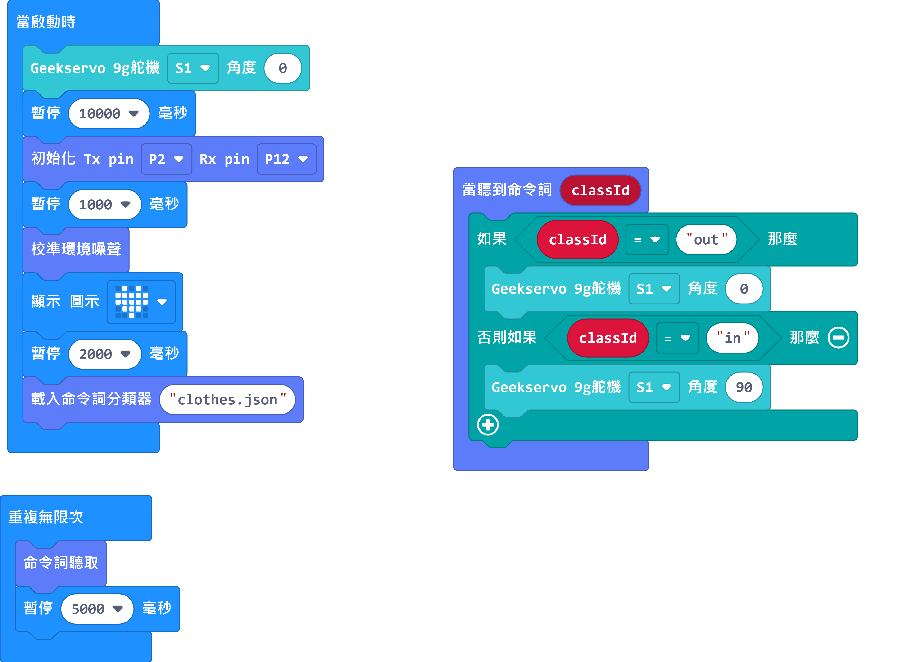

# 聲控智能晾衣架

## 組裝說明書下載

[組裝說明書下載](https://drive.google.com/drive/folders/1wg_edUZFrqyUONA0FJ6vFBkGArRsfnf4?usp=sharing)

## 參考程式

### 訓練程式

[參考程式下載](https://makecode.microbit.org/_i6od5EPD2PT8)

### 主程式

[參考程式下載](https://makecode.microbit.org/_5Ky879De1ebM)

## 模型玩法

首先訓練好語音模型，按A錄下晾衣，按B錄下收回，最後按A+B儲存語音模型。

然後就可以用主程式，用語音操控晾衣架的位置。