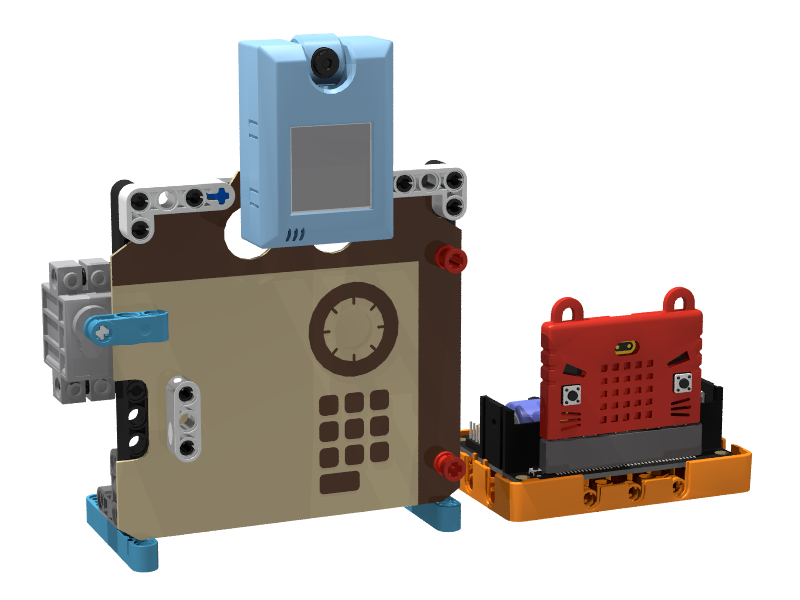
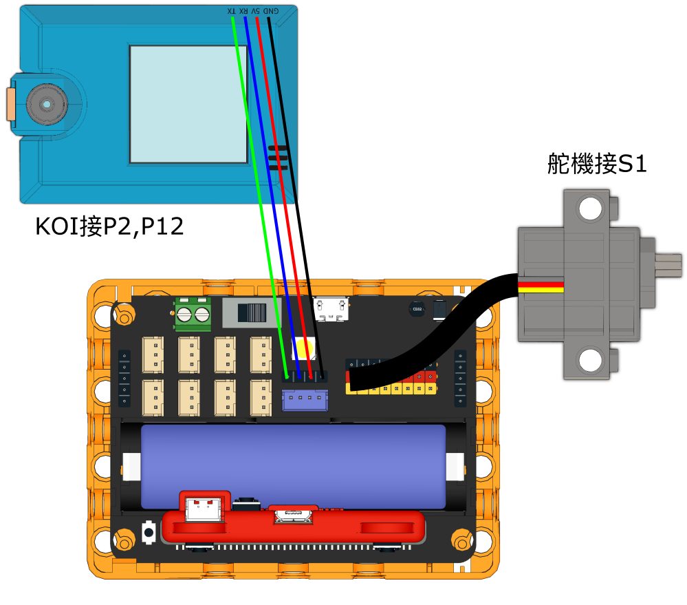
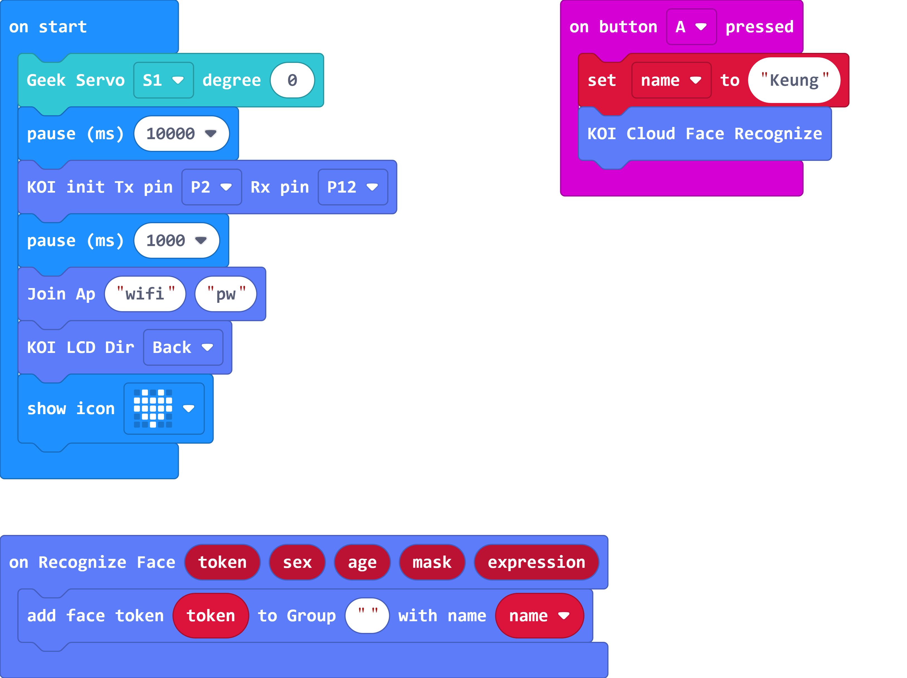
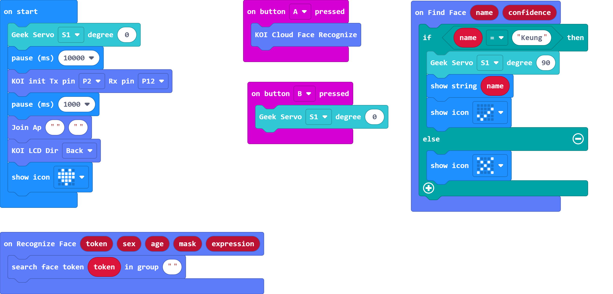

# 生物辨識保險箱

## 組裝說明書下載

[組裝說明書下載](https://drive.google.com/drive/folders/1wg_edUZFrqyUONA0FJ6vFBkGArRsfnf4?usp=sharing)

## 參考程式

### 訓練程式

[參考程式下載](https://makecode.microbit.org/_Hir6kKLXcYUk)

### 主程式

[參考程式下載](https://makecode.microbit.org/_D8jDyuUzs4pP)

## 模型玩法

首先使用訓練程式，按A將人臉加到資料庫。

然後用主程式，按A辨認人臉，如果人臉是在資料庫裡就打開保險箱。按B鎖上保險箱。