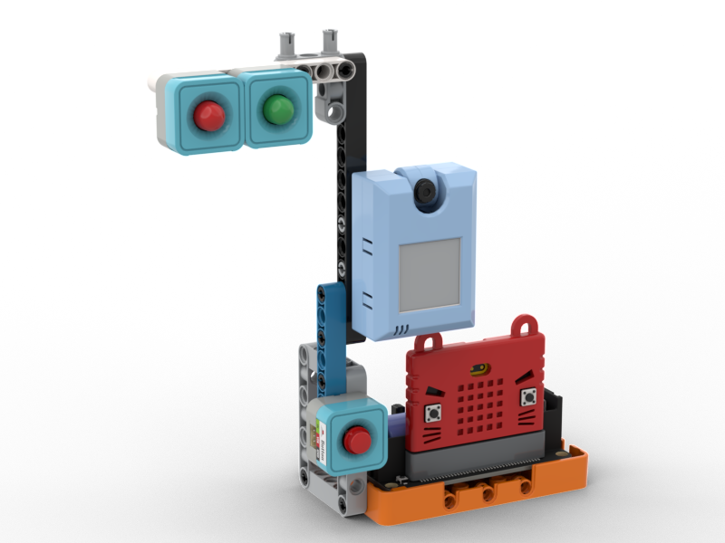
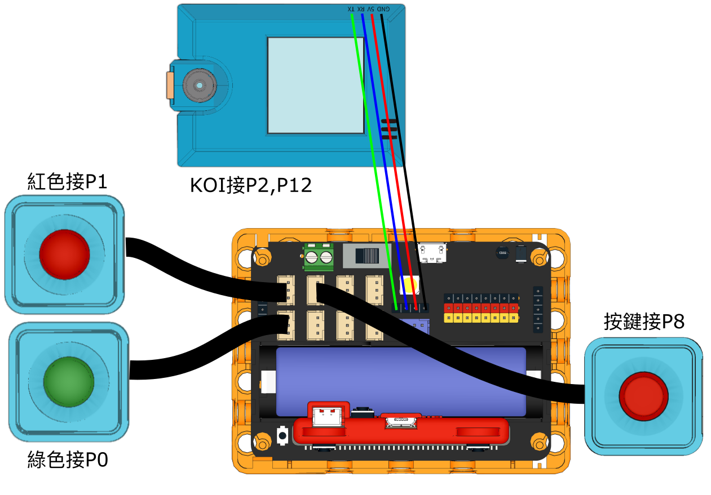
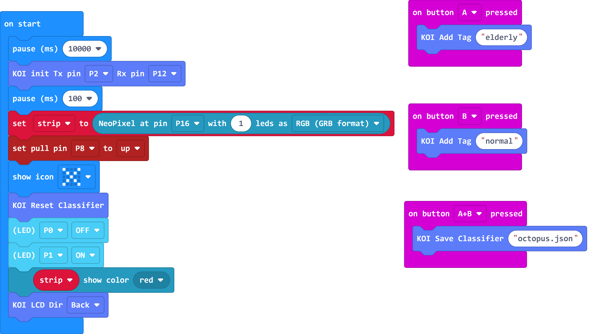
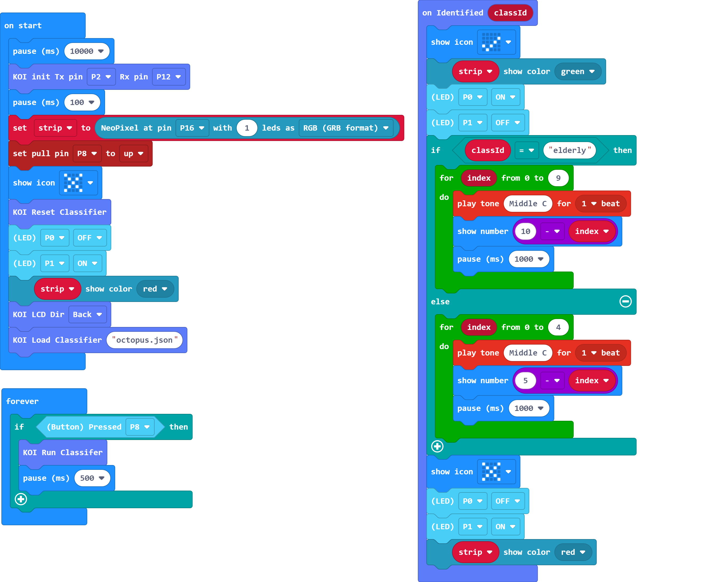

# AI道路管理系統

## 組裝說明書下載

[組裝說明書下載](https://drive.google.com/drive/folders/1vPB1nm2KgCbI8fHl_VWVD3YiAxTgYQWc?usp=sharing)

## 參考程式

### 訓練程式

[參考程式下載](https://makecode.microbit.org/_AqhbAq1U6KJ9)

### 主程式

[參考程式下載](https://makecode.microbit.org/_i0JT9q5h10oo)

## 模型玩法

首先使用訓練程式，按A錄下長者和兒童八達通，按B錄下成人八達通和背景，按A+B儲存模型。

然後用主程式，按下按鍵辨認，假如辨認到的是長者或兒童八達通就會給予較長時間。