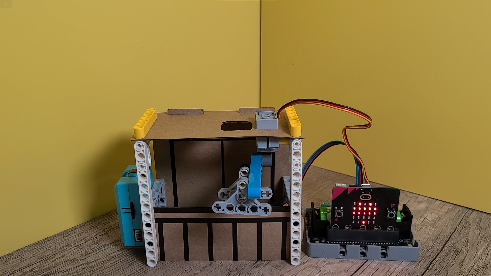
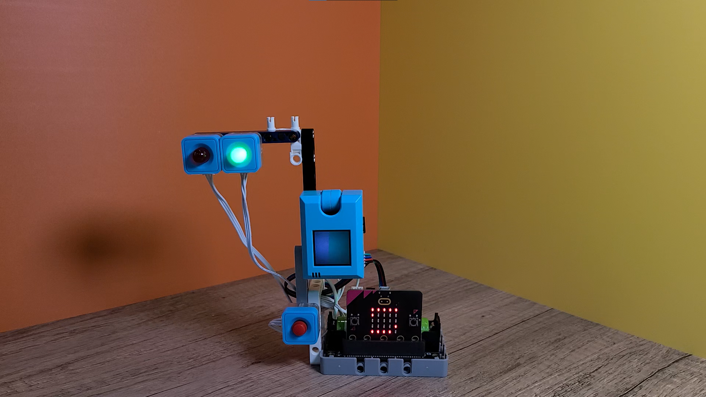
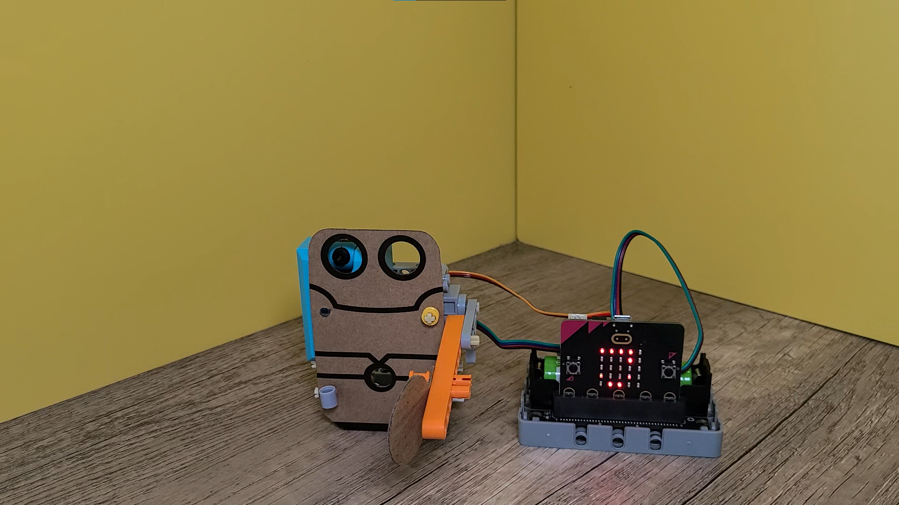
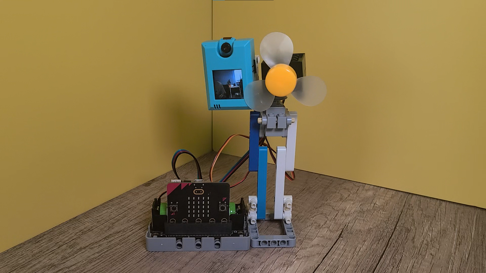
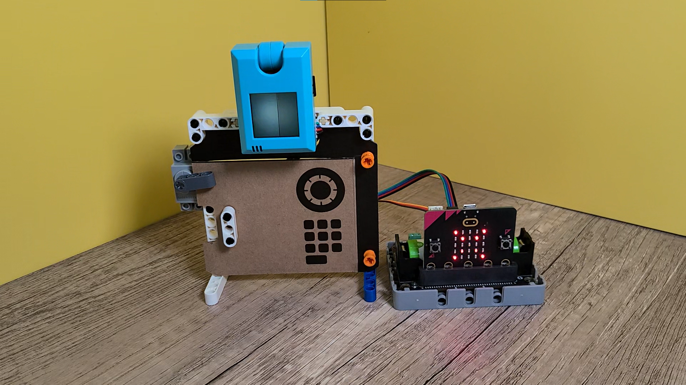

# 發明家套件AI升級案例一覽

在發明家套件添上一隻KOI的話，套件的玩法就會更加多了，以下數款案例使用了KOI進化成為了AI版的應用案例。

## 聲控智能晾衣架

[觀看Youtube影片](https://youtu.be/aO9EQKJsBQI?t=12)

## AI道路管理系統

[觀看Youtube影片](https://youtu.be/aO9EQKJsBQI?t=28)

## 芝麻閘門

[觀看Youtube影片](https://youtu.be/aO9EQKJsBQI?t=75)

## AI人面追蹤風扇

[觀看Youtube影片](https://youtu.be/aO9EQKJsBQI?t=91)

## 生物辨識保險箱

[觀看Youtube影片](https://youtu.be/aO9EQKJsBQI?t=125)