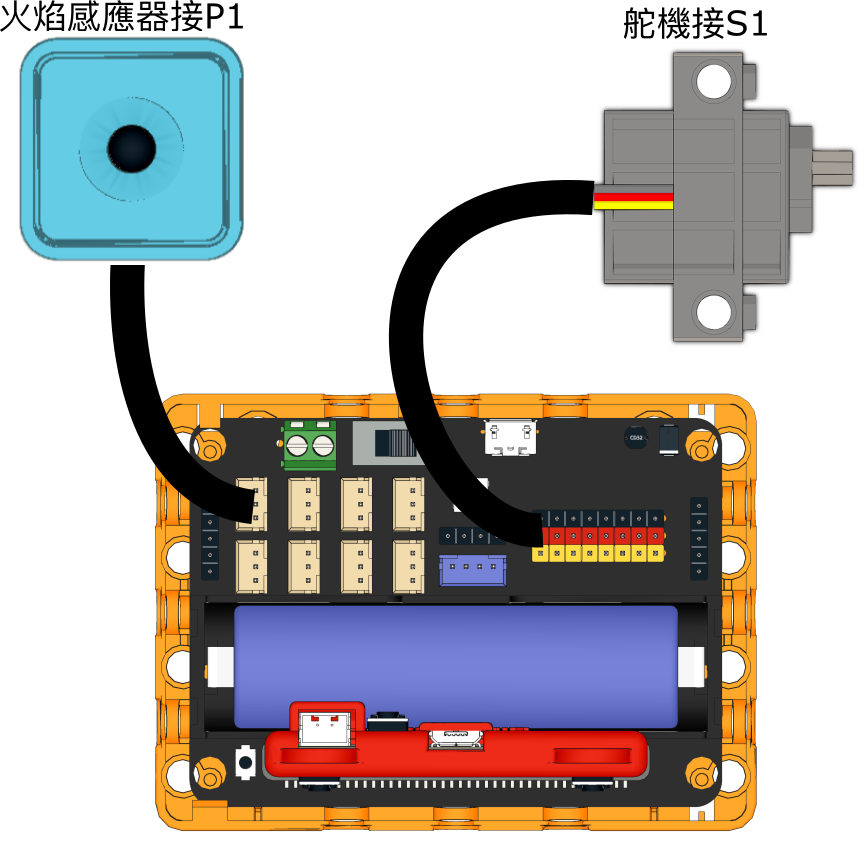

# 防火警報

## 組裝說明書下載

[組裝說明書下載](https://drive.google.com/drive/folders/1wg_edUZFrqyUONA0FJ6vFBkGArRsfnf4?usp=sharing)

## 參考程式

[參考程式下載](https://makecode.microbit.org/_dbrY2iaAuc4v)

## 模型玩法

探測器會左右搖擺，探測到火焰就會發出警告。