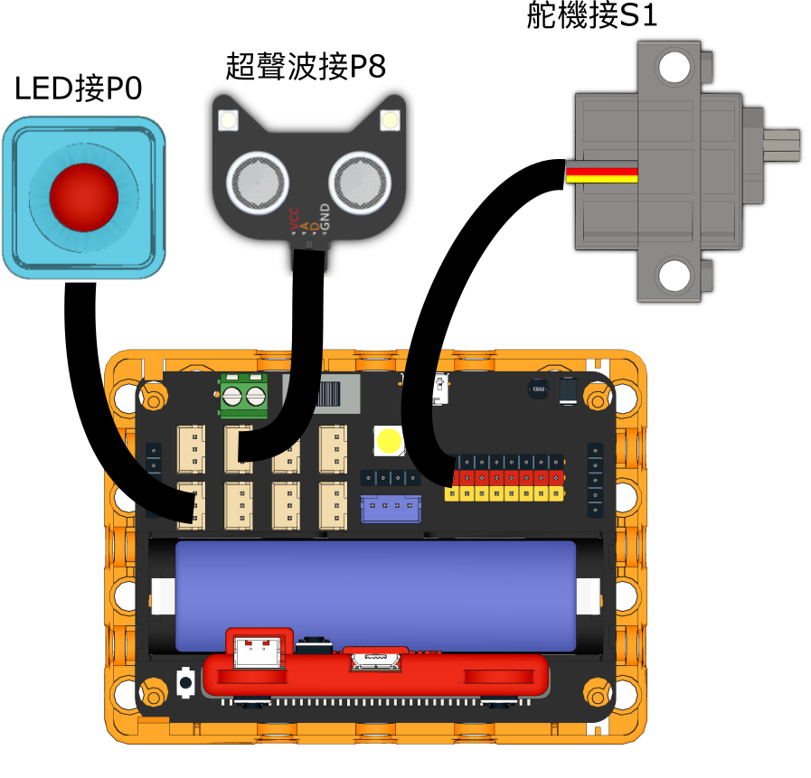
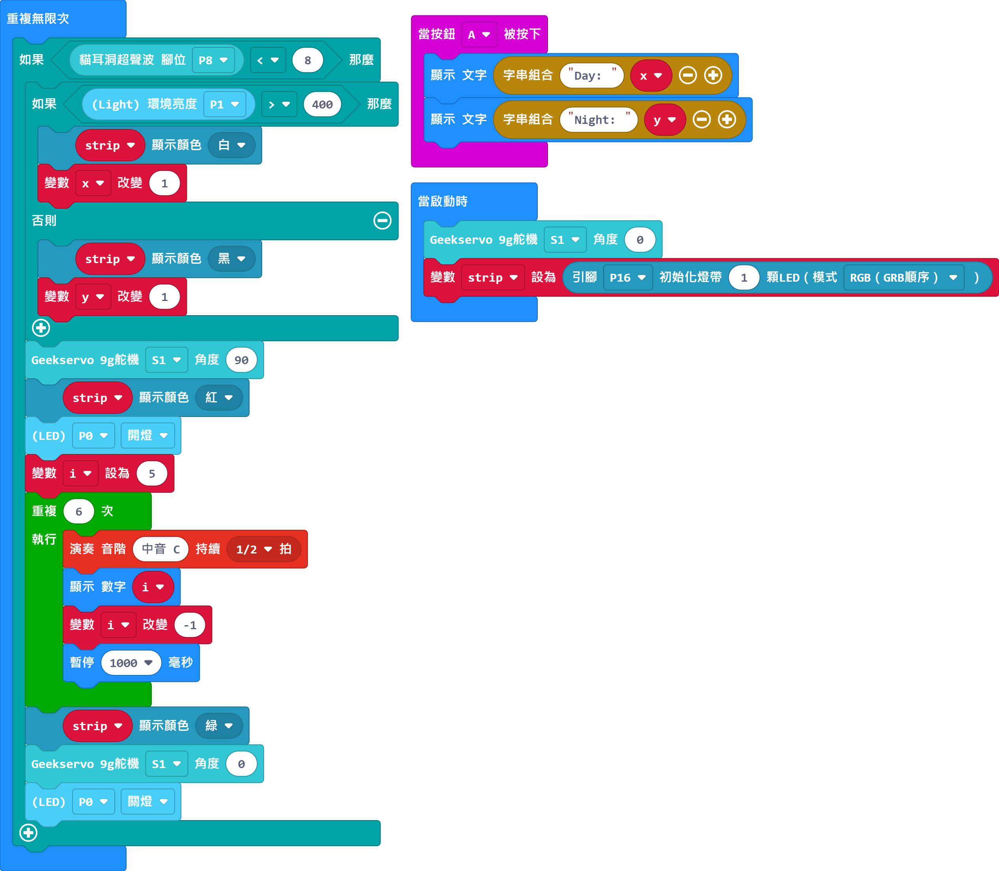

# 電子閘門

## 組裝說明書下載

[組裝說明書下載](https://drive.google.com/drive/folders/1wg_edUZFrqyUONA0FJ6vFBkGArRsfnf4?usp=sharing)

## 參考程式

[參考程式下載](https://makecode.microbit.org/_6sfaCkU7w8ur)

## 模型玩法

當有人時閘門會自動關閉，等到完成檢測才打開閘門讓人前進。按下A鍵查看日間與晚間的檢測人數。