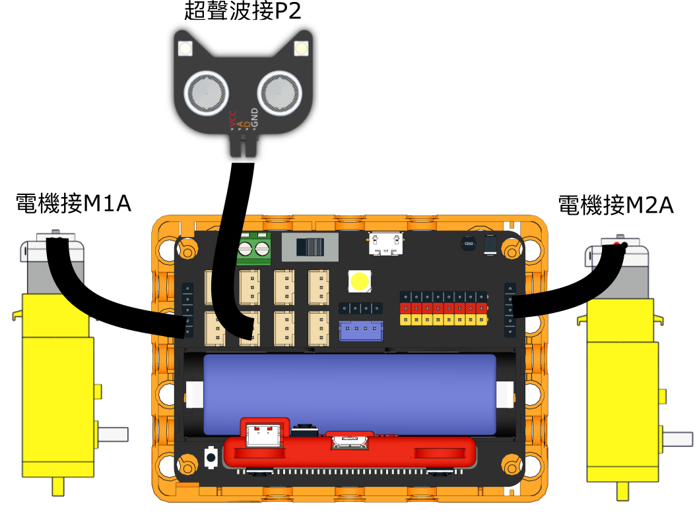
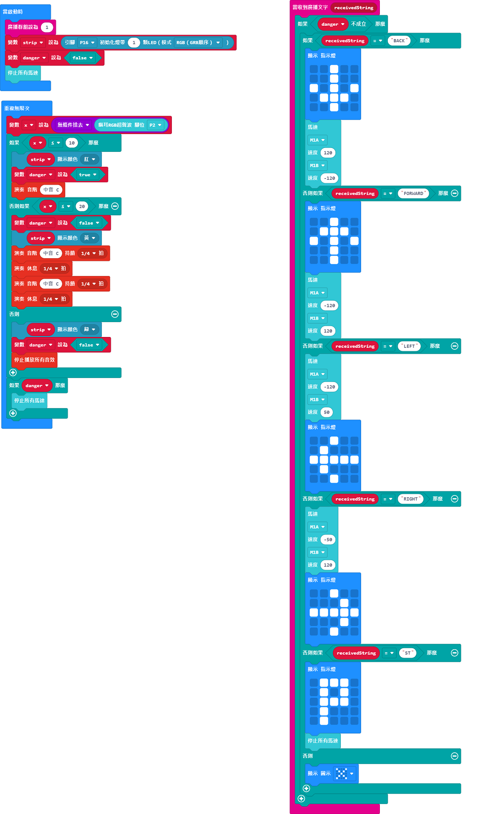

# 遙控三輪車

## 組裝說明書下載

[組裝說明書下載](https://drive.google.com/drive/folders/1wg_edUZFrqyUONA0FJ6vFBkGArRsfnf4?usp=sharing)

## 參考程式

### 遙控器參考程式

[參考程式下載](https://makecode.microbit.org/_YeCK5aEFfP0p)

### 三輪車參考程式

[參考程式下載](https://makecode.microbit.org/_WcKYvVXvWR9v)

## 模型玩法

使用遙控器控制三輪車，向前後或左右傾斜Micro:bit，三輪車會改變方向。