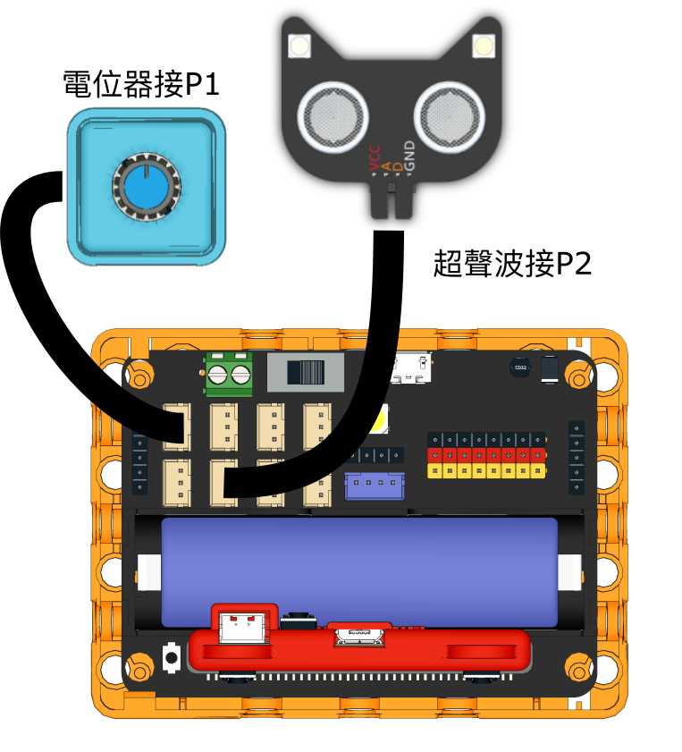
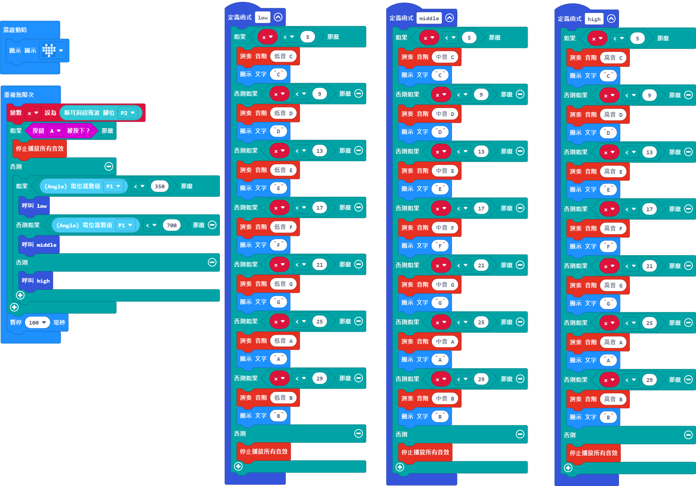

# 鋼琴拉奏

## 組裝說明書下載

[組裝說明書下載](https://drive.google.com/drive/folders/1wg_edUZFrqyUONA0FJ6vFBkGArRsfnf4?usp=sharing)

## 參考程式

[參考程式下載](https://makecode.microbit.org/_X3eJyy7r755z)

## 模型玩法

利用距離控制音調的鋼琴。扭動電位器控制音高。