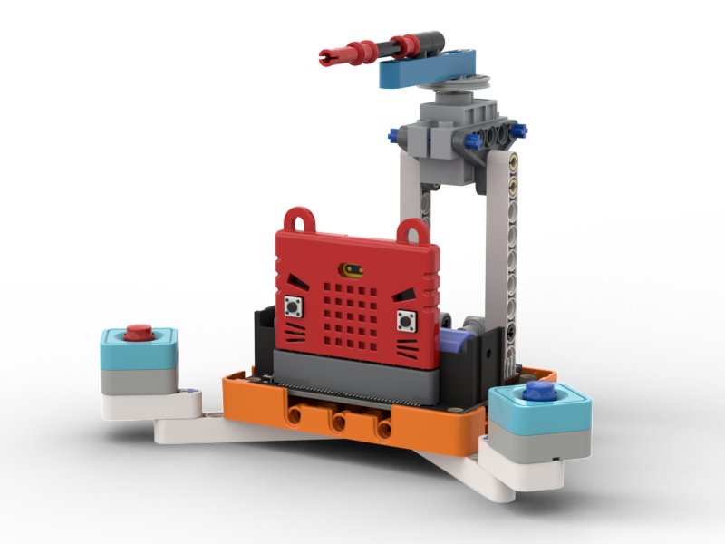
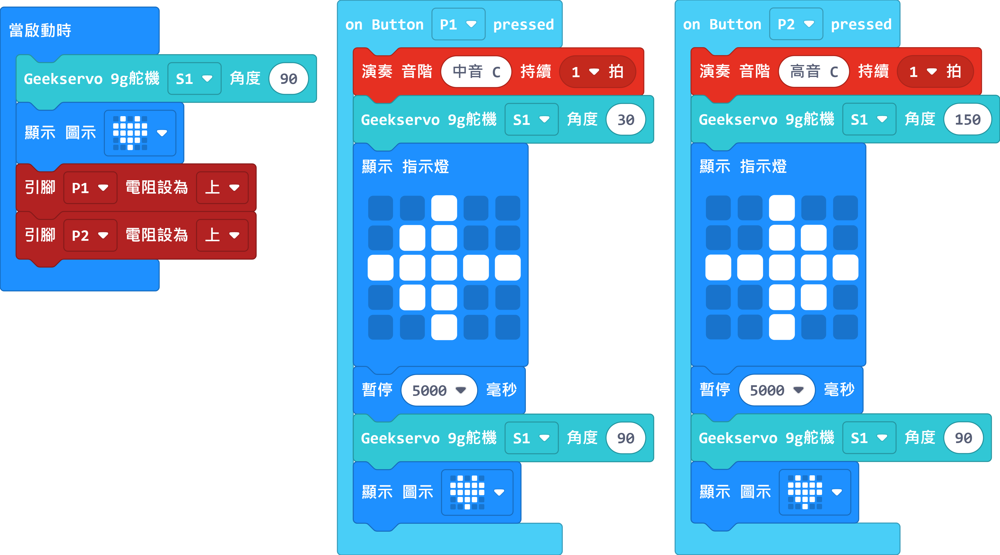

# 搶答機

## 組裝說明書下載

[組裝說明書下載](https://drive.google.com/drive/folders/1wg_edUZFrqyUONA0FJ6vFBkGArRsfnf4?usp=sharing)

## 參考程式

[參考程式下載](https://makecode.microbit.org/_acKe5J6UxioC)

## 模型玩法

指針會指向最快按下按鍵的玩家。