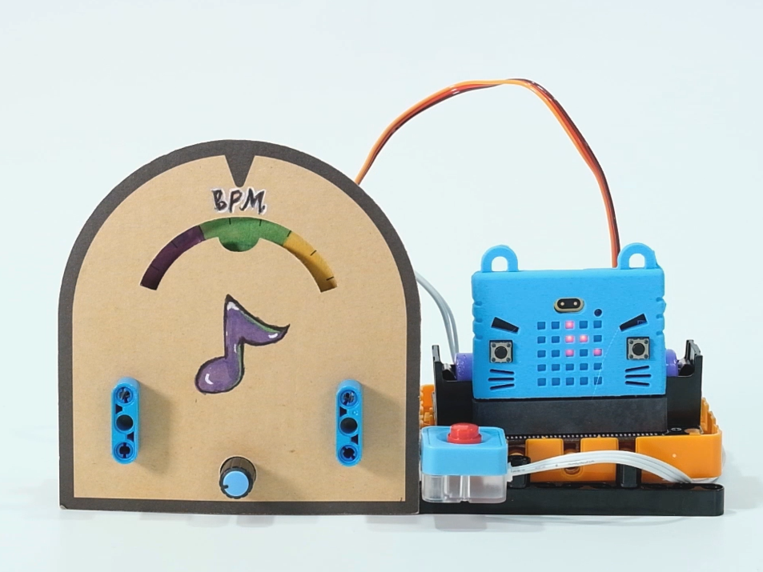

# 節拍機

## 組裝說明書下載

[組裝說明書下載](https://drive.google.com/drive/folders/1wg_edUZFrqyUONA0FJ6vFBkGArRsfnf4?usp=sharing)

## 參考程式

[參考程式下載](https://makecode.microbit.org/_gCcc9XVe7YLm)

## 模型玩法

使用電位器調較速度，用A和B鍵選擇拍子，按下數碼按鍵啟動拍子機。