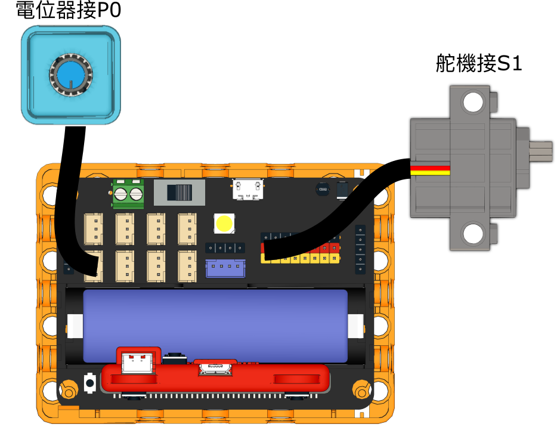

# 保險箱

## 組裝說明書下載

[組裝說明書下載](https://drive.google.com/drive/folders/1wg_edUZFrqyUONA0FJ6vFBkGArRsfnf4?usp=sharing)

## 參考程式

[參考程式下載](https://makecode.microbit.org/_15PgwD3tDDR9)

## 模型玩法

使用電位器選擇字母，按A輸入。輸入所有字母之後按B確認，假如密碼正確就會打開夾萬。