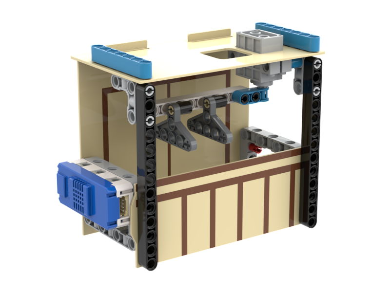

# 發明家套件WifiBrick升級案例一覽

只要在發明家套件上加上一隻WifiBrick就可以實現IoT物聯網的應用案例。IoT應用案例可以支援各種物聯網平台，包括MakerCloud和ObjectBlocks。

## 示範短片(使用MakerCloud作示範)

[示範短片](https://youtu.be/VwnHU8kOWNw)

## IoT智能路燈

## IoT智能晾衣架

## IoT智能閘門

## IoT智能門鎖

## IoT智能防火警報

