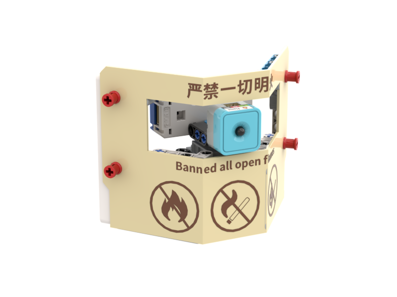
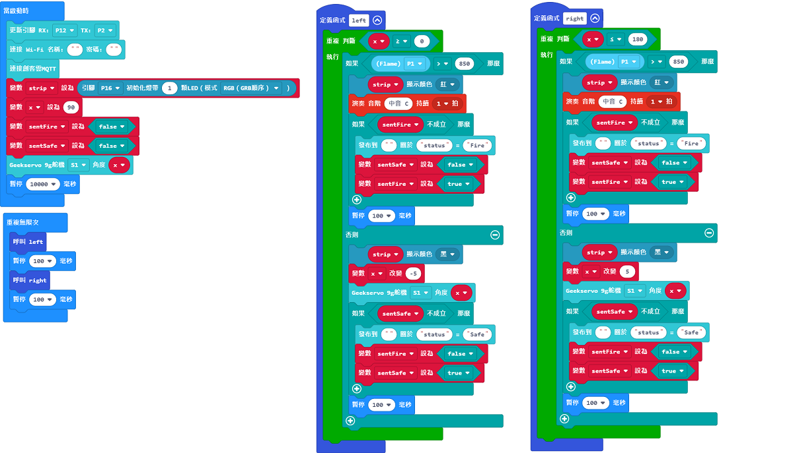
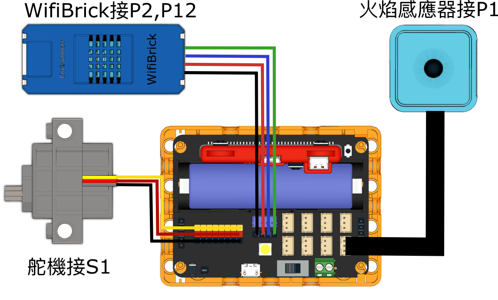

# IoT智能防火警報

## 組裝說明書下載

#### 右擊->另存為...

[組裝說明書](./images/firealarm.pdf)

## 參考程式

[參考程式](https://makecode.microbit.org/_h0qb5PCtjhAV)

## 模型玩法

1. 填入Wifi登入資料與MakerCloud主題名稱。
2. 探測器會左右擺動，當感應器探測到火焰時(可以電筒模擬)，就會響起警報並且在物聯網平台警告用家。
