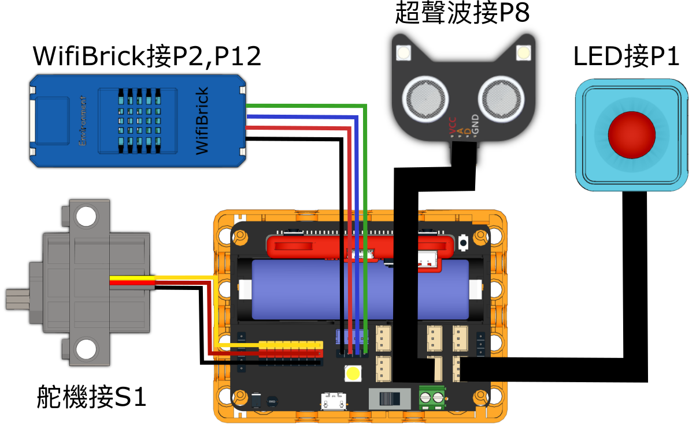
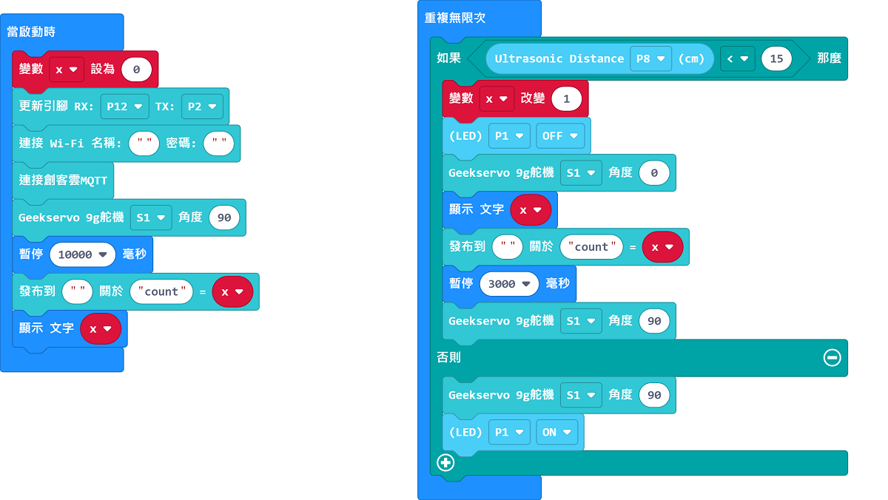
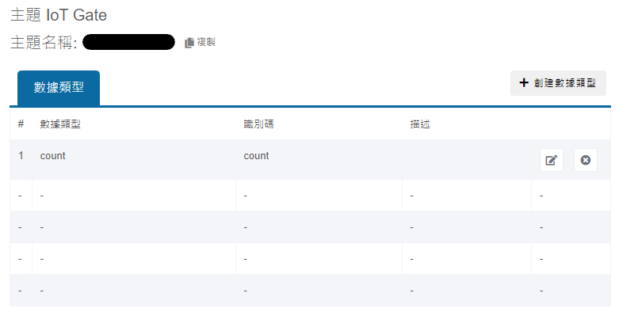
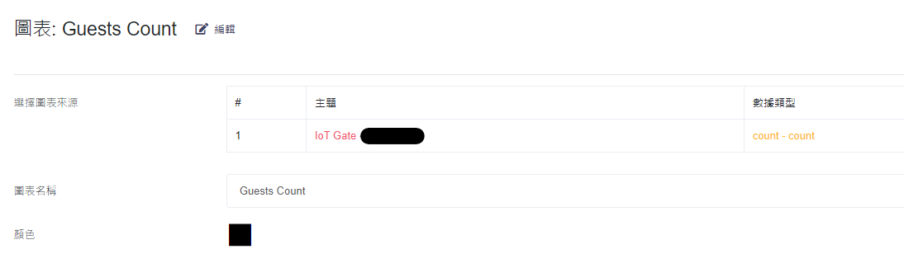
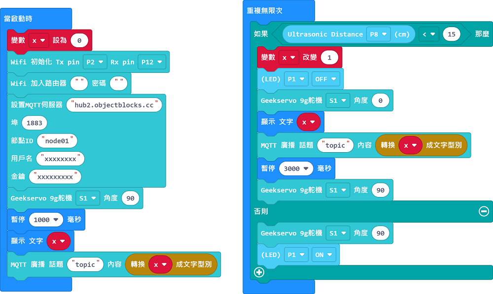
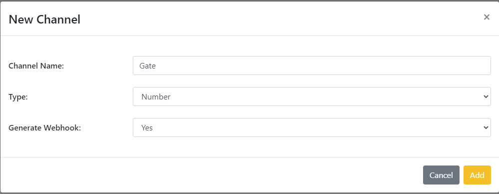
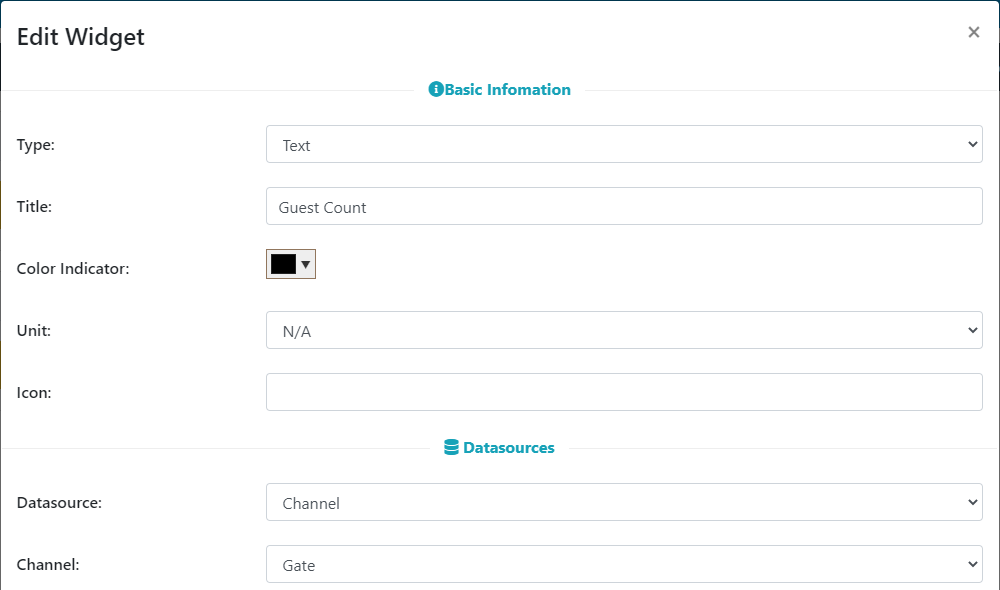

# IoT智能閘門

## 組裝說明書下載

#### 右擊->另存為...

[組裝說明書](./images/gate.pdf)

## 參考程式(MakerCloud版本)

[參考程式](https://makecode.microbit.org/_gspRu6UMDTpb)

## MakerCloud平台設定

## 模型玩法

1. 填入Wifi登入資料與MakerCloud主題名稱。
2. 當有人接近超聲波測距時，閘門就會打開。
3. 裝置會將經過閘門的人數上傳到物聯網平台。

## 參考程式(ObjectBlocks版本)

[參考程式](https://makecode.microbit.org/_Jd2gqadbAdC5)

## ObjectBlocks平台設定

## 模型玩法

1. 填入Wifi登入資料、ObjectBlocks登入資料與ObjectBlocks主題名稱。
2. 當有人接近超聲波測距時，閘門就會打開。
3. 裝置會將經過閘門的人數上傳到物聯網平台。