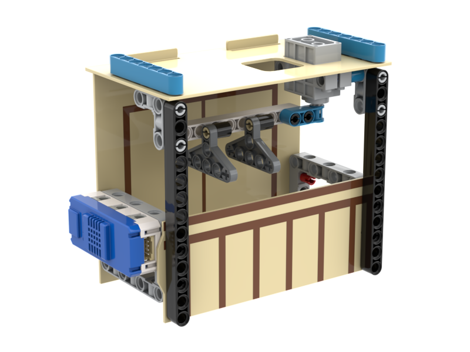
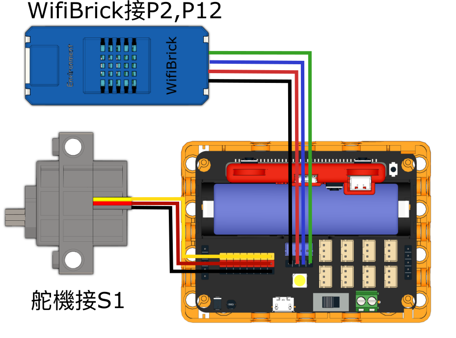
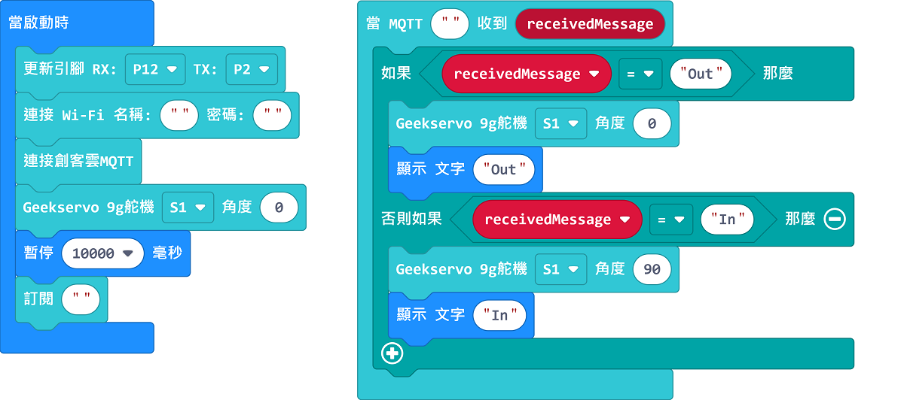
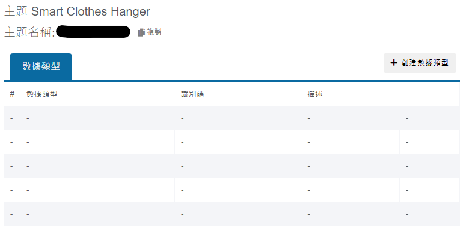
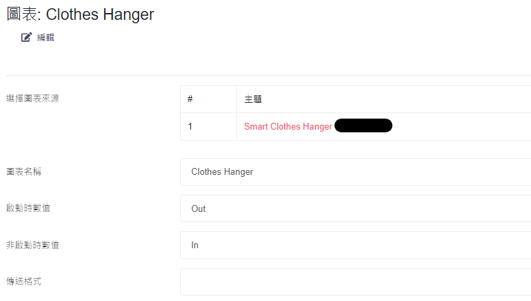
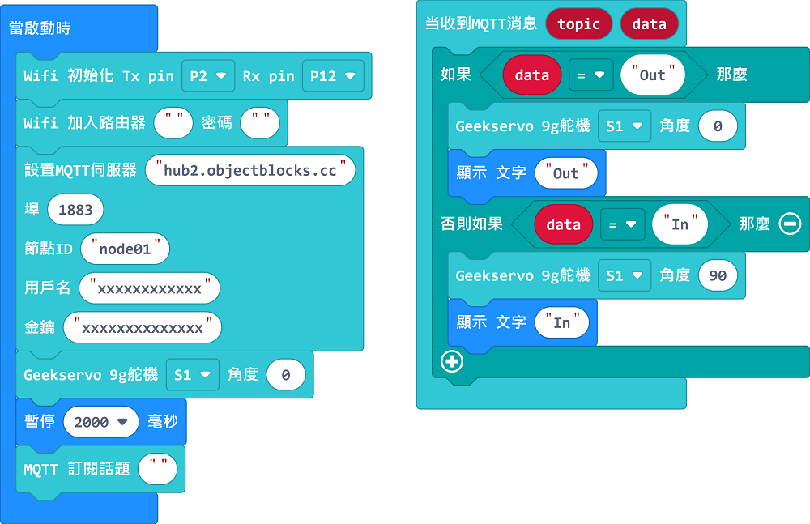

# IoT智能晾衣架

## 組裝說明書下載

[下載組裝說明書](https://github.com/kittenbothk/kittenbothk/raw/master/Kits/classroom_inventor/iot_instructions/images/hanger.pdf)

## 參考程式(MakerCloud版本)

[參考程式](https://makecode.microbit.org/_2taeR6c9f2FY)

## MakerCloud平台設定

## 模型玩法

1. 填入Wifi登入資料與MakerCloud主題名稱。
2. 在MakerCloud發佈文字訊息”Out”或”In”，模型就會伸出或收回晾衣架。

## 參考程式(ObjectBlocks版本)

[參考程式](https://makecode.microbit.org/_DMcdUw6rRbzW)

## ObjectBlocks平台設定

## 模型玩法

1. 填入Wifi登入資料、ObjectBlocks登入資料與ObjectBlocks主題名稱。
2. 在ObjectBlocks發佈文字訊息”Out”或”In”，模型就會伸出或收回晾衣架。