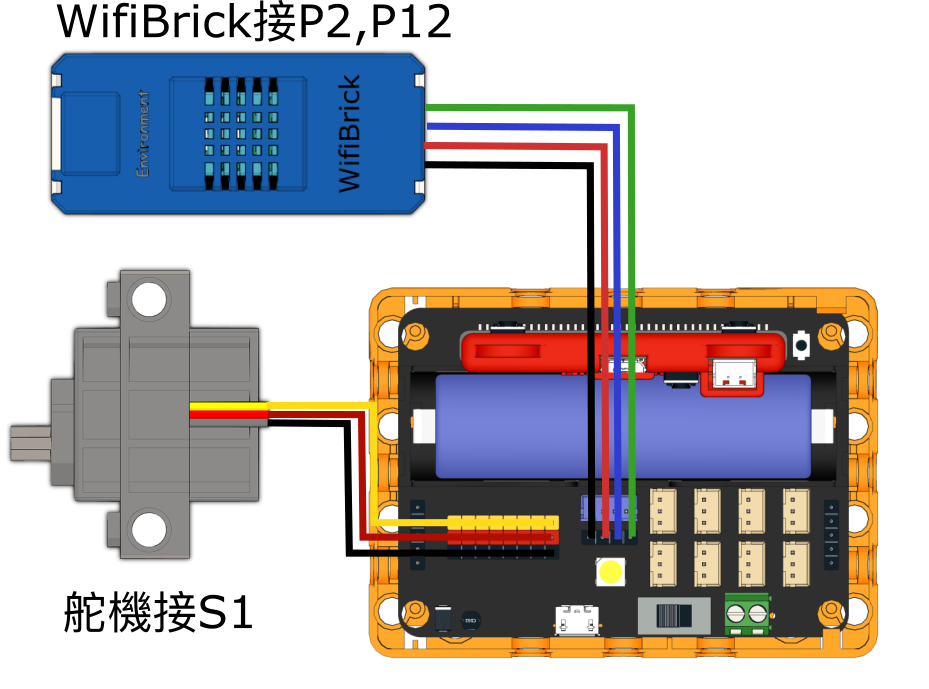

# IoT智能門鎖

## 組裝說明書下載

#### 右擊->另存為...

[組裝說明書](./images/lock.pdf)

## 參考程式

[參考程式](https://makecode.microbit.org/_bfx7V2Ao0Mii)

## 模型玩法

1. 填入Wifi登入資料與MakerCloud主題名稱。
2. 在MakerCloud發佈文字訊息”OPEN”或”CLOSE”，模型就會鎖上或解鎖門鎖。