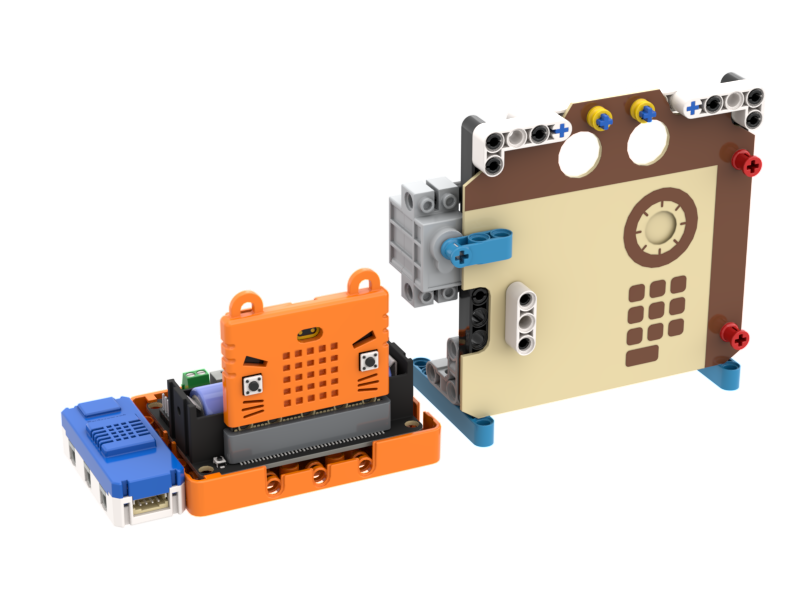
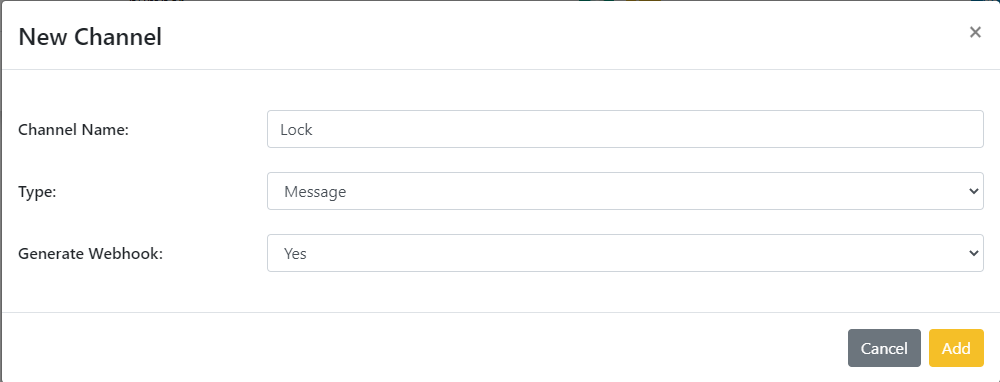
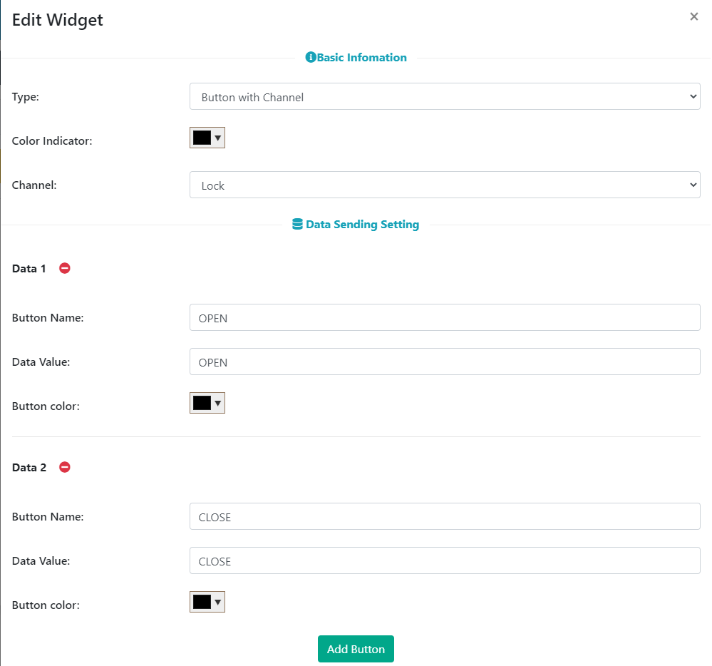

# IoT智能門鎖

## 組裝說明書下載

#### 右擊->另存為...

[組裝說明書](./images/lock.pdf)

## 參考程式(MakerCloud版本)

[參考程式](https://makecode.microbit.org/_bfx7V2Ao0Mii)

## MakerCloud平台設定

## 模型玩法

1. 填入Wifi登入資料與MakerCloud主題名稱。
2. 在MakerCloud發佈文字訊息”OPEN”或”CLOSE”，模型就會鎖上或解鎖門鎖。

## 參考程式(ObjectBlocks版本)

[參考程式](https://makecode.microbit.org/_77U675FraA82)

## ObjectBlocks平台設定

## 模型玩法

1. 填入Wifi登入資料、ObjectBlocks登入資料與ObjectBlocks主題名稱。
2. 在ObjectBlocks發佈文字訊息”OPEN”或”CLOSE”，模型就會鎖上或解鎖門鎖。