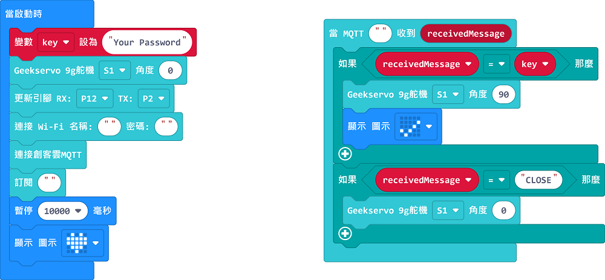

# IoT智能夾萬

## 組裝說明書下載

[下載組裝說明書](https://github.com/kittenbothk/kittenbothk/raw/master/Kits/classroom_inventor/iot_instructions/images/lock.pdf)

## 參考程式(MakerCloud版本)

[參考程式](https://makecode.microbit.org/_PRwgraY2sUbv)

## MakerCloud平台設定

## 模型玩法

1. 填入Wifi登入資料與MakerCloud主題名稱。
2. 在key裏填入夾萬密碼。
3. 在MakerCloud發佈文字訊息，內容為你的密碼。模型就會打開夾萬門鎖。
4. 在MakerCloud發佈文字訊息”CLOSE”，模型就會鎖上夾萬門鎖。