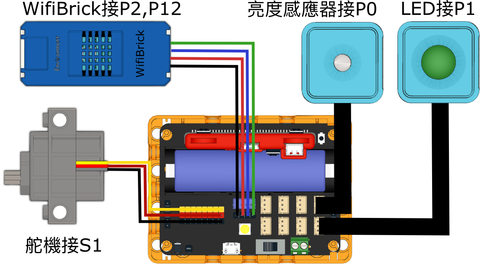
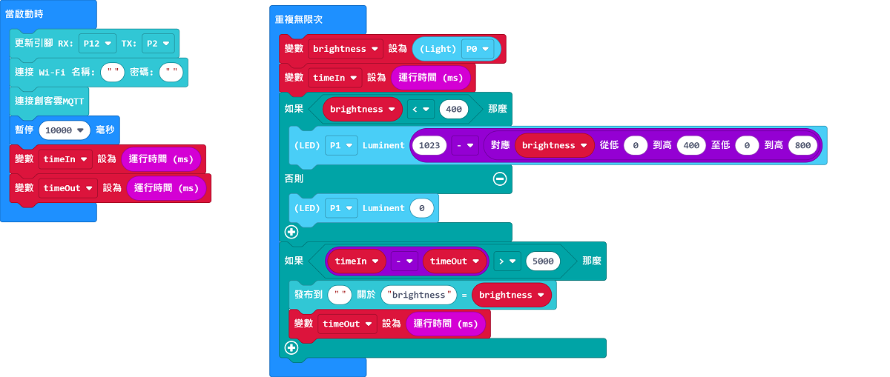
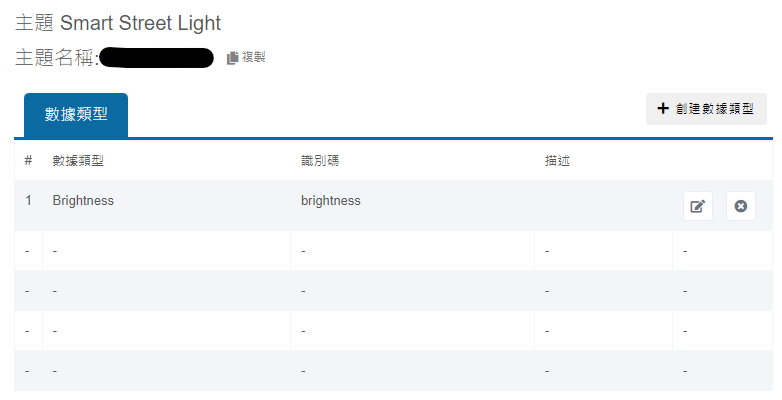
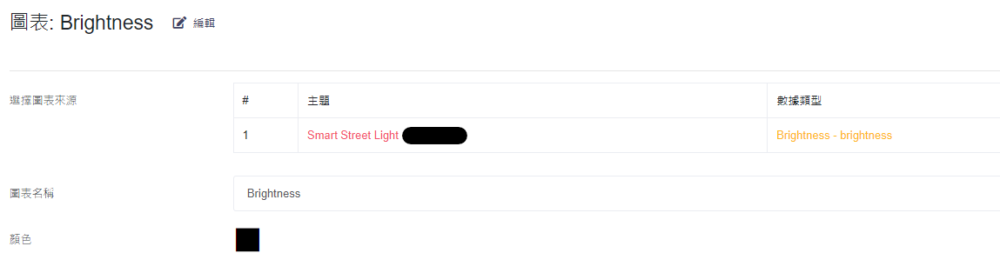
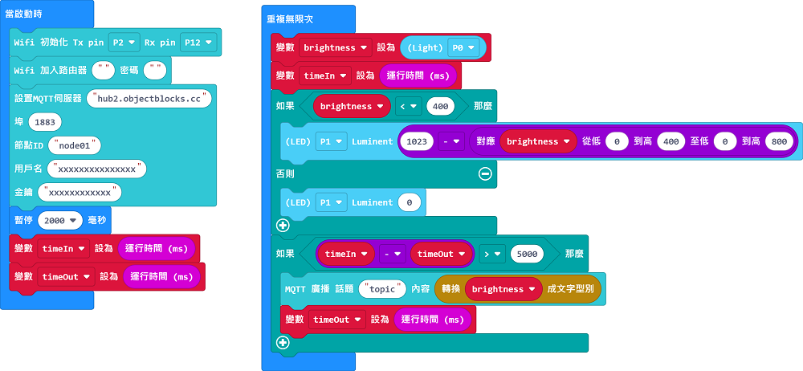
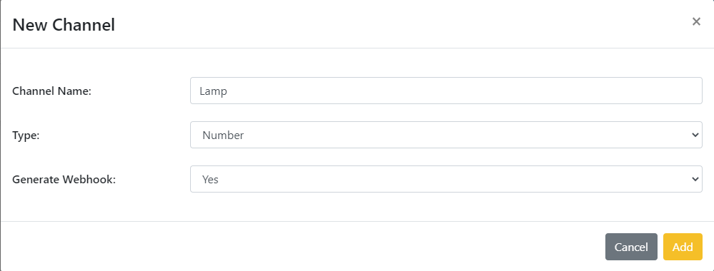
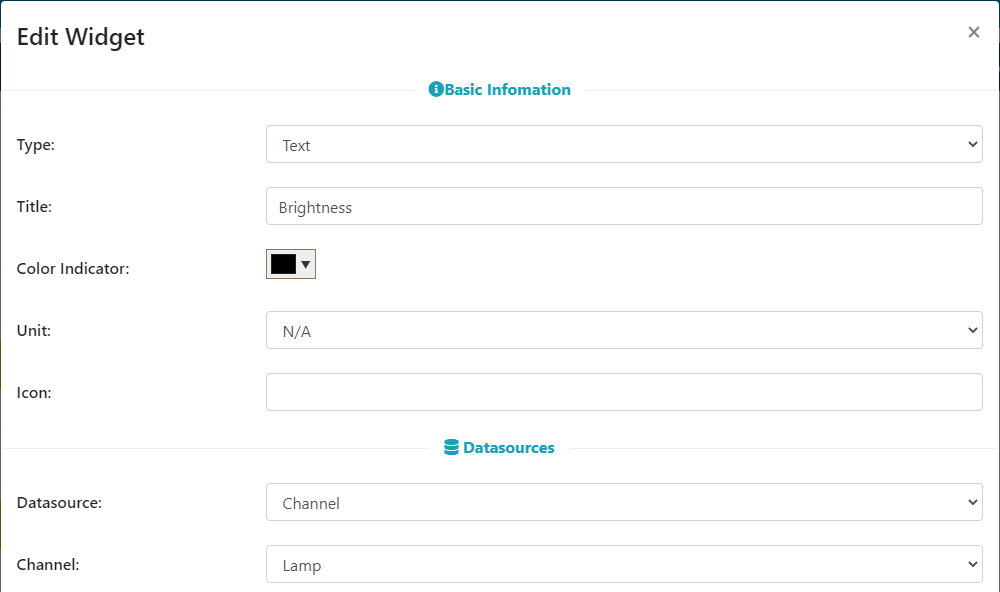

# IoT智能路燈

## 組裝說明書下載

#### 右擊->另存為...

[組裝說明書](./images/streetlamp.pdf)

## 參考程式(MakerCloud版本)

[參考程式](https://makecode.microbit.org/_F629j8DTKAe0)

## MakerCloud平台設定

## 模型玩法

1. 填入Wifi登入資料與MakerCloud主題名稱。
2. 路燈會將環境亮度的數值上傳到物聯網平台。
3. 當環境轉暗時，路燈就會自動點亮。環境越暗路燈就會越亮。

## 參考程式(ObjectBlocks版本)

[參考程式](https://makecode.microbit.org/_YrJELVRmmJMm)

## ObjectBlocks平台設定

## 模型玩法

1. 填入Wifi登入資料、ObjectBlocks登入資料與ObjectBlocks主題名稱。
2. 路燈會將環境亮度的數值上傳到物聯網平台。
3. 當環境轉暗時，路燈就會自動點亮。環境越暗路燈就會越亮。