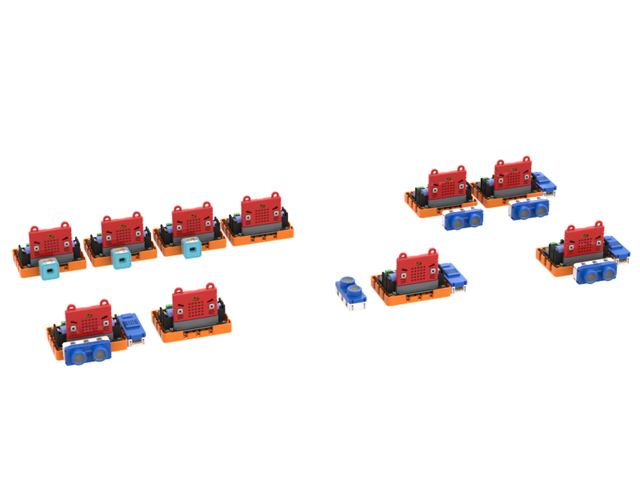
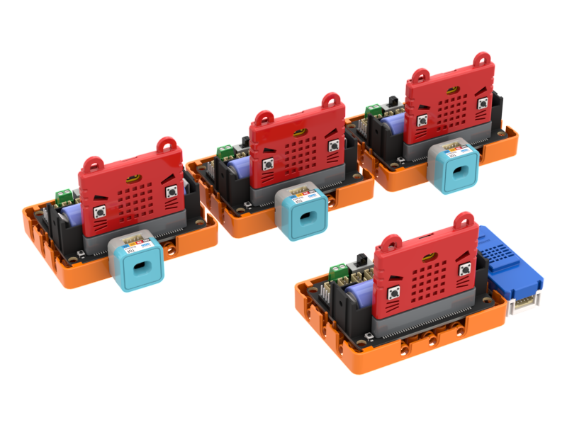

# KittenBot體適能測驗套件

KittenBot體適能測驗套件是一套針對體適能測驗而設計的一套教育套件，套件包含5組體適能測驗。包括掌上壓、仰臥起坐、坐地前伸、Y平衡和平板支撐合共5款體能測驗。套件配合WifiBrick與IoT平台使用，實現體適能測驗的物聯網應用。KittenBot希望透過此套件將STEM與體育結合起來，讓學生學習編程之餘養成運動的好習慣。

## 套件特色

- 結合STEM與體育科，達致STEM跨學科應用的宗旨
- 結合WifiBrick與IoT平台的運用，達致體育科的物聯網應用
- 提供五種常見的體適能測試套裝
- 培養學生運動的好習慣

## 套件內容

- Robotbit Edu x9
- Powerbrick 超聲波測距模組 x3
- Sugar 激光測距模組 x3
- Sugar 按鍵模組 x1
- WifiBrick x5
- 18650鋰電池 x5
- 連接線
- 塑膠積木包

## 詳細介紹

### 1. 掌上壓測驗

以超聲波測距檢測用戶完成掌上壓的次數，然後上傳至物聯網平台。

### 2. 臥仰起坐測驗

以超聲波測距檢測用戶完成臥仰起坐的次數，然後上傳至物聯網平台。

### 3. 座地前伸測驗

以超聲波測距檢測用戶座地前伸的距離，然後上傳至物聯網平台。

### 4. Y平衡測驗

以超聲波測距檢測用戶Y平衡的距離，然後上傳至物聯網平台。

### 5. 平板支撐測驗

以超聲波測距檢測用戶平板支撐的時長，然後上傳至物聯網平台。

