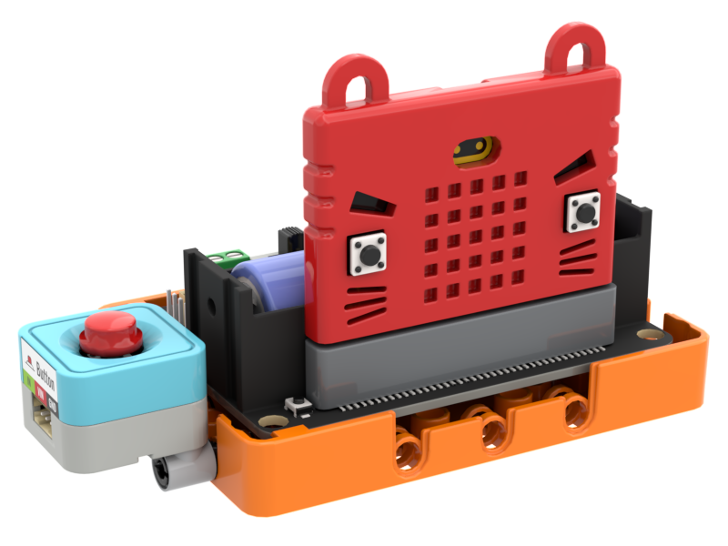
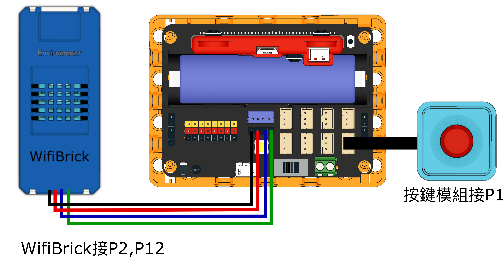
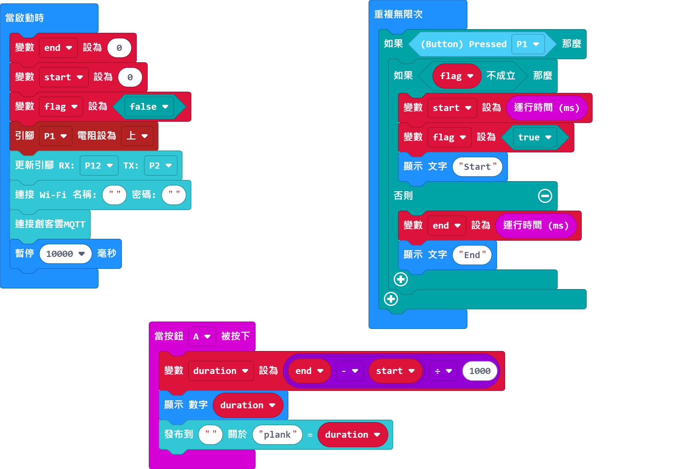

# 5. 平板支撐

以超聲波測距檢測用戶平板支撐的時長，然後上傳至物聯網平台。

## 搭建說明書

[搭建說明書下載]()

## 參考接線

## 參考程式

[參考程式下載](https://makecode.microbit.org/_bLA2urgA7L92)

## 使用方法

1. 將整組感應器放在地上，並將超聲波感應器固定在胸前的地上。
2. 開動Robotbit，等待WifiBrick連接到MakerCloud。
3. 當用戶開始平板支撐時就按下按鍵模組，裝置就會開始計時。
4. 當用戶結束測試之後再按一次按鍵模組，裝置就會計算開始到完結的時間。
5. 按下A鍵查看並發布平板支撐的維持時間。