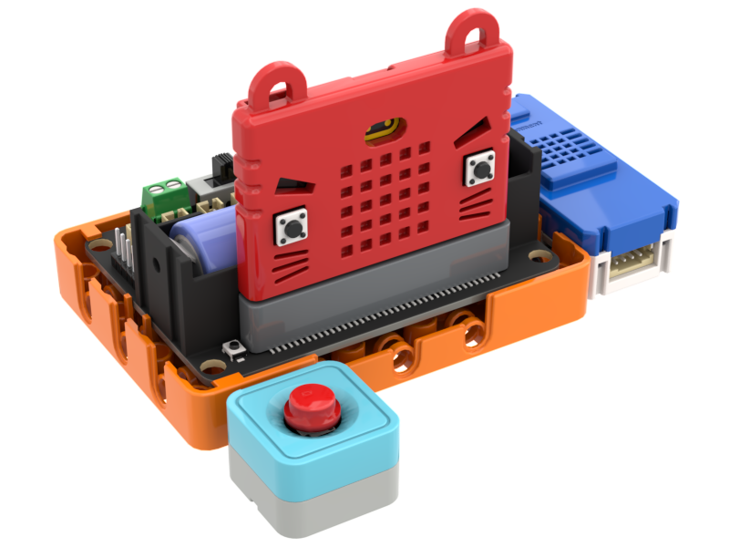
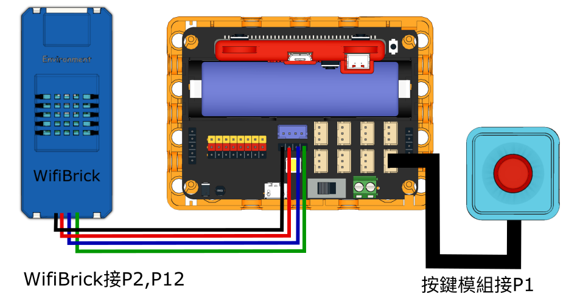

# 5. 平板支撐

以超聲波測距檢測用戶平板支撐的時長，然後上傳至物聯網平台。

## 搭建說明書

[搭建說明書下載]()

## 參考接線

## 參考程式

[參考程式下載](https://makecode.microbit.org/_f9kYzjA12RMg)

## 使用方法

1. 將整組感應器放在地上，並將超聲波感應器固定在胸前的地上。
2. 開動Robotbit，等待WifiBrick連接到MakerCloud。
3. 當用戶進行平板支撐時，身體進入超聲波感應器20cm範圍內就會開始計時，當用戶無法繼續，身體離開超聲波感應器20cm範圍外就會停止計時。
4. 按下A鍵查看並發布平板支撐的維持時間。