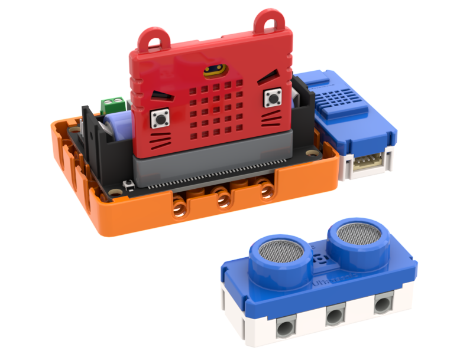
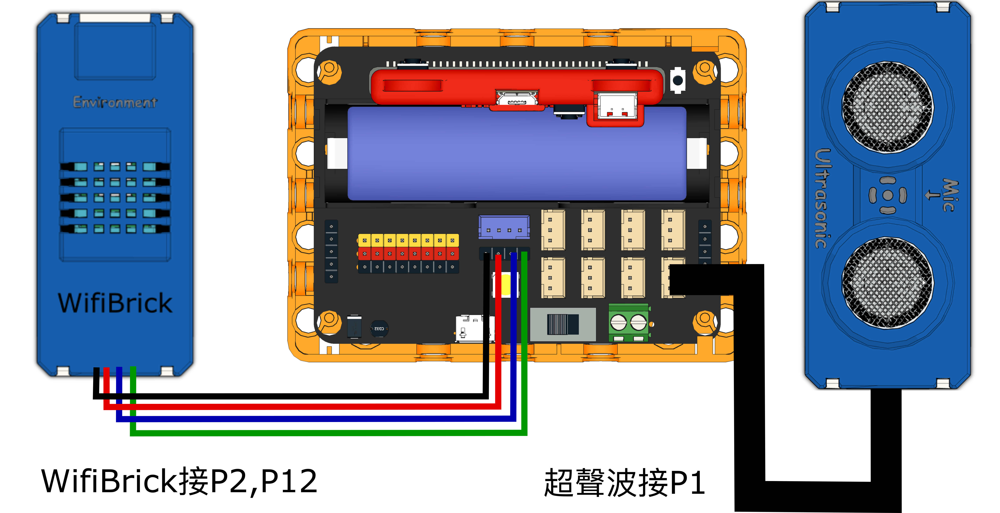
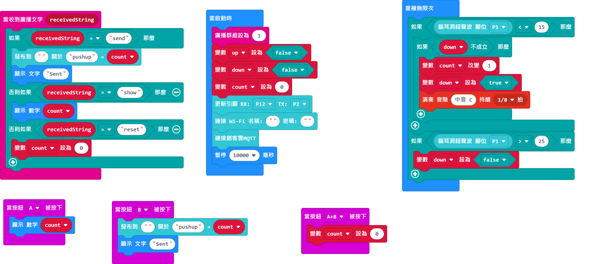

# 1. 掌上壓測試

以超聲波測距檢測用戶完成掌上壓的次數，然後上傳至物聯網平台。

## 搭建說明書

[搭建說明書下載](https://github.com/kittenbothk/kittenbothk/raw/master/Kits/fitness/images/situp.pdf)

## 參考接線

## 參考程式

[參考程式下載](https://makecode.microbit.org/_J0LH7kKtrYwA)

## 使用方法

1. 將整組感應器放在地上，並將超聲波感應器固定在胸前的地上。
2. 開動Robotbit，等待WifiBrick連接到MakerCloud。
3. 當用戶做掌上壓時，身體進入超聲波感應器15cm範圍內就會響一下示意到達最低點。當用戶撐起身體，身體與感應器距離大於25cm時就會再響一下示意到達頂點。
4. 按下A鍵查看完成掌上壓次數。
5. 按下B鍵上傳數據至物聯網。
4. 按下A+B鍵重置感應器，將次數歸0。