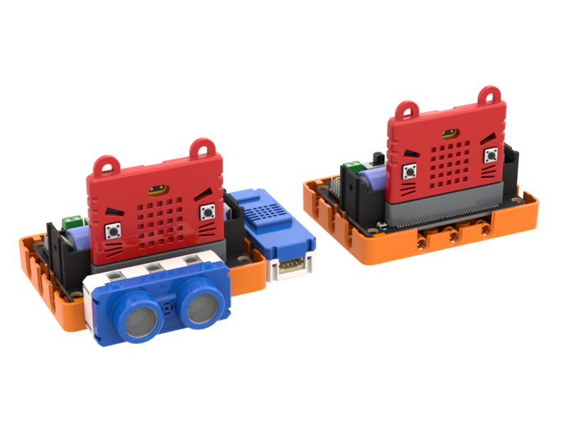
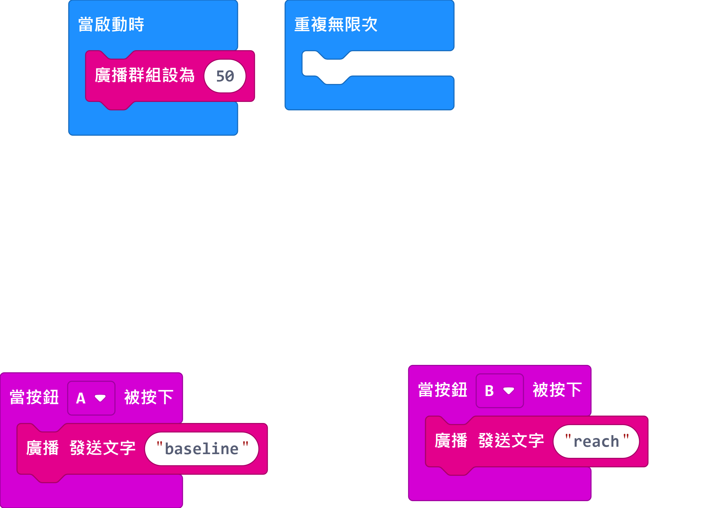
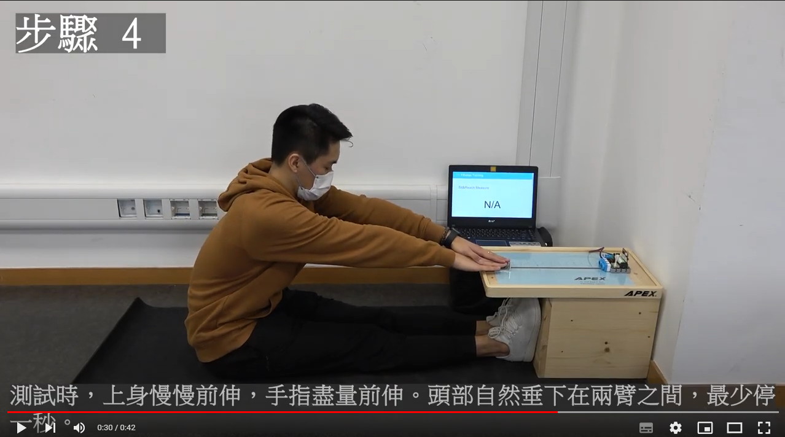

# 3. 座地前伸

以超聲波測距檢測用戶座地前伸的距離，然後上傳至物聯網平台。

## 搭建說明書

[搭建說明書下載](https://github.com/kittenbothk/kittenbothk/raw/master/Kits/fitness/images/sitandreach.pdf)

## 參考接線

### 感應器

## 參考程式

### 感應器

[感應器參考程式下載](https://makecode.microbit.org/_Vgdgqe0kxJk5)

### 控制器

[控制器參考程式下載](https://makecode.microbit.org/_5aifcuU6xgW6)

## 使用方法

1. 將感應器用橡筋帶固定在手腕上，另一隻手拿著控制器。
2. 開啟Robotbit，等待WifiBrick連接到網絡。
3. 坐直然後將手伸直，按下控制器的A鍵，量度起始的位置。
4. 身體向前伸，同時保持伸直手臂，當去到盡頭的時候按下控制器的B鍵。
5. 感應器會顯示坐地前伸的距離並將數據發布到物聯網。

## 示範短片

